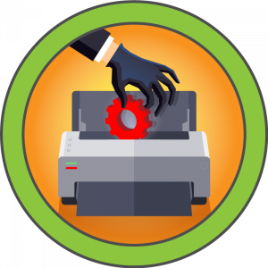
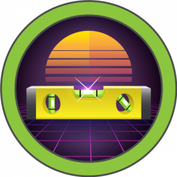
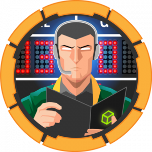
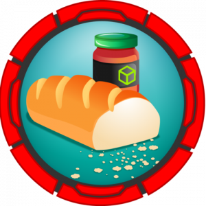
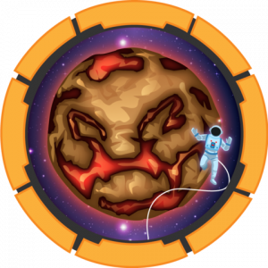
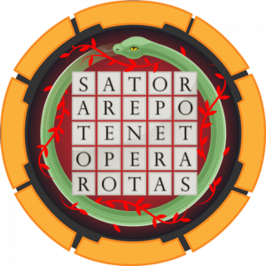

# Hack The Box Writeups by Şefik Efe
__Would you like to__ respect me in Hack The Box? Thanks in advance :)  
<a href="https://app.hackthebox.com/profile/184235">
  
  </img>
</a> 
<a href=https://www.buymeacoffee.com/f4T1H21>
  
  </img>
</a>
  
I'll be posting __retired__ boxes' writeups.

___You can search keywords and/or topics between writeups using top left corner search bar.___

## Index Table

_My favourite writeup so far:_ ___[Breadcrumbs](Boxes/Breadcrumbs/README.md)___

 

|&nbsp;&nbsp;&nbsp;&nbsp;&nbsp;&nbsp;Box&nbsp;&nbsp;&nbsp;&nbsp;&nbsp;&nbsp;|Writeup|Difficulty|OS|Foothold|Lateral Movement|Privilege Escalation|
|---|-------|----------|--|--------|----------------|--------------------|
|<a href="https://app.hackthebox.com/machines/Backdoor"></img></a>|[Backdoor](Boxes/Backdoor/README.md)|Easy|Linux|[/proc Enumeration](Boxes/Backdoor/README.md#enumerating-tcp-listening-ports-through-procnettcp) using [Dir Traversal](Boxes/Backdoor/README.md#directory-traversal) & [GDB Server Remote Payload Exec](Boxes/Backdoor/README.md#foothold-gdb-server-remote-payload-execution)|None|[Screen cronjob](Boxes/Backdoor/README.md#privilege-escalation-screen-cronjob)|
|<a href="https://app.hackthebox.com/machines/Secret"></img></a>|[Secret](Boxes/Secret/README.md)|Easy|Linux|[JS Code Review](Boxes/Secret/README.md#javascript-source-code-analysis) & [Signing JWT using Bash, OS CMDI, Custom Exploitation](Boxes/Secret/README.md#foothold-os-command-injection)|None|[C Code Review](Boxes/Secret/README.md#c-source-code-analysis) & [Leaking Memory by triggering CoreDumps](Boxes/Secret/README.md#further-enumeration-on-coredumps)|
|<a href="https://app.hackthebox.com/machines/Driver"></img></a>|[Driver](Boxes/Driver/README.md)|Easy|Windows|[Grab NTLMv2 using SMB path in scf files](Boxes/Driver/README.md#foothold-grab-user-authentication-hash-using-smb-path-in-scf-files)|None|[PrintNightmare (CVE-2021-1675)](Boxes/Driver/README.md#privilege-escalation-printnightmare-cve-2021-1675)|
|<a href="https://app.hackthebox.com/machines/Horizontall"></img></a>|[Horizontall](Boxes/Horizontall/README.md)|Easy|Linux|[Strapi CMS RCE](Boxes/Horizontall/README.md#foothold-strapi-cms-rce)|None|[Sudo Heap Based Bof (sudoedit)](Boxes/Horizontall/README.md#privilege-escalation) & [Laravel Exploitation (phpggc)](Boxes/Horizontall/README.md#exploiting-laravel)|
|<a href="https://app.hackthebox.com/machines/TheNotebook"></img></a>|[TheNotebook](Boxes/TheNotebook/README.md)|Medium|Linux|[JWT Auth RS256](Boxes/TheNotebook/README.md#rs256-signing)|[Home backup](Boxes/TheNotebook/README.md#lateral-home-backup)|[Docker Escape Overwriting RunC](Boxes/TheNotebook/README.md#privesc-docker-escape-overwriting-runc)|
|<a href="https://app.hackthebox.com/machines/Armageddon"></img></a>|[Armageddon](Boxes/Armageddon/README.md)|Easy|Linux|[Drupalgeddon2](Boxes/Armageddon/README.md#foothold-drupalgeddon-2)|[MySQL](Boxes/Armageddon/README.md#lateral-movement-mysql)|[snapd (dirty_sock)](Boxes/Armageddon/README.md#privesc-snapd-dirty_sock-cve-2019-7304)|
|<a href="https://app.hackthebox.com/machines/Breadcrumbs"></img></a>|[Breadcrumbs](Boxes/Breadcrumbs/README.md)|Hard|Windows|[LFI](Boxes/Breadcrumbs/README.md#lfi) & [PHP SESSION](Boxes/Breadcrumbs/README.md#php-session) & [Powershell File Upload](Boxes/Breadcrumbs/#file-upload)|[SQLite DB](Boxes/Breadcrumbs/README.md#sqlite-db)|[Reversing](Boxes/Breadcrumbs/README.md#reversing) & [SQLi](Boxes/Breadcrumbs/README.md#sqli)|
|<a href="https://app.hackthebox.com/machines/Atom"></img></a>|[Atom](Boxes/Atom/README.md)|Medium|Windows|[Signature Validation Bypass in electron-updater](Boxes/Atom/README.md#foothold-signature-validation-bypass-in-electron-updater)|None|[PortableKanban](Boxes/Atom/README.md#portablekanban) & [redis](Boxes/Atom/README.md#redis)|
|<a href="https://app.hackthebox.com/machines/Ophiuchi"></img></a>|[Ophiuchi](Boxes/Ophiuchi/README.md)|Medium|Linux|[SnakeYaml Deserialization](Boxes/Ophiuchi/README.md#foothold-snakeyaml-deserialization)|None|[WebAssembly formats](Boxes/Ophiuchi/README.md#privilege-escalation-webassembly-formats)|
|<a href="https://app.hackthebox.com/machines/Spectra"></img></a>|[Spectra](Boxes/Spectra/README.md)|Easy|Linux|[WordPress reverse shell](Boxes/Spectra/README.md#foothold-wordpress-reverse-shell)|None|[initctl with sudo](Boxes/Spectra/README.md#root-part)|
|<a href="https://app.hackthebox.com/machines/Tentacle"></img></a>|[Tentacle](Boxes/Tentacle/README.md)|Hard|Linux|[CVE-2020-7247](Boxes/Tentacle/README.md#foothold-cve-2020-7247)|None|[Cronjob abuse](Boxes/Tentacle/README.md#escalating-admin-cronjob-abuse) & [Misconfigured keytab](Boxes/Tentacle/README.md#escalating-root-misconfigured-keytab)|
|<a href="https://app.hackthebox.com/machines/Tenet"></img></a>|[Tenet](Boxes/Tenet/README.md)|Medium|Linux|[PHP Object Injection](Boxes/Tenet/README.md#foothold-php-object-injection-aka-deserialization)|None|[Race Condition](Boxes/Tenet/README.md#privilege-escalation-race-condition)|
|<a href="https://app.hackthebox.com/machines/ScriptKiddie"></img></a>|[ScriptKiddie](Boxes/ScriptKiddie/README.md)|Easy|Linux|[Msfvenom Template Injection](Boxes/ScriptKiddie/README.md#exploiting-and-getting-a-shell)|None|[msfconsole with sudo](Boxes/ScriptKiddie/README.md#privilege-escalation-to-root)|

 

___─ Written by f4T1H ─___
